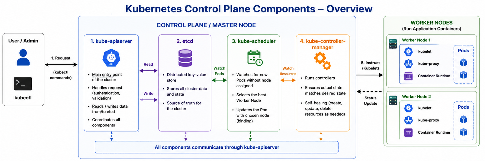
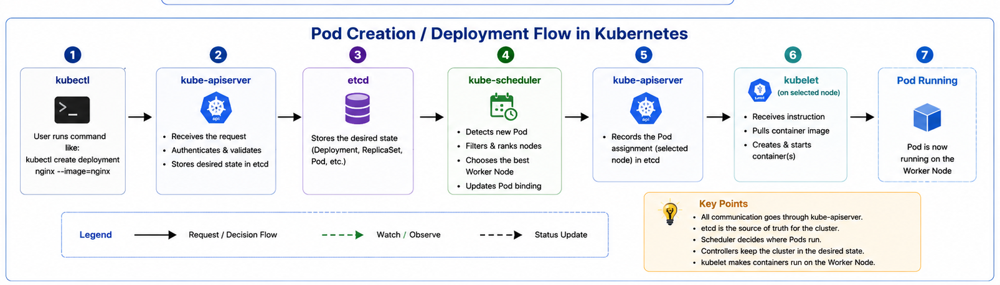

# Kubernetes Control Plane Components - Myanmar Note

> This note explains the four main Kubernetes Control Plane components in Myanmar language with English visual diagrams.

---

## 1. Control Plane ဆိုတာဘာလဲ?

**Control Plane** ဆိုတာ Kubernetes cluster တစ်ခုလုံးကို စီမံခန့်ခွဲပေးတဲ့ အဓိကအစိတ်အပိုင်းဖြစ်ပါတယ်။ Worker Node တွေပေါ်မှာ application containers တွေကို တိုက်ရိုက် run ပေးတာမဟုတ်ဘဲ cluster ထဲမှာ **ဘာတွေဖြစ်ရမယ်**, **ဘယ် Pod ကို ဘယ် Node ပေါ်တင်ရမယ်**, **Node down ဖြစ်ရင် ဘယ်လိုပြန်ထိန်းရမယ်** ဆိုတာတွေကို ဆုံးဖြတ်ပေးပါတယ်။

အလွယ်မှတ်ရန် -

```text
Control Plane = Cluster ကို စီမံခန့်ခွဲသူ
Worker Node   = Application containers တွေကို တကယ် run ပေးသူ
Pod           = Kubernetes ထဲမှာ application run သည့် အခြေခံ unit
```

Control Plane ထဲမှာ အဓိက component ၄ ခုရှိပါတယ်။

| Component                 | အဓိကအလုပ်                                                                | မှတ်ရန်                        |
| ------------------------- | ------------------------------------------------------------------------ | ------------------------------ |
| `kube-apiserver`          | Request များကို လက်ခံ၊ စစ်ဆေး၊ coordinate လုပ်သည်                        | Cluster ရဲ့ main entrance      |
| `etcd`                    | Cluster state နှင့် configuration data များကို သိမ်းသည်                  | Kubernetes database            |
| `kube-scheduler`          | Pod ကို ဘယ် Worker Node ပေါ် run မလဲ ဆုံးဖြတ်သည်                         | Pod placement decision maker   |
| `kube-controller-manager` | Desired state နှင့် actual state ကို ကိုက်ညီအောင် စောင့်ကြည့်/ပြုပြင်သည် | Self-healing controller system |

---

## 2. Control Plane Components Visual Diagram



---

## 3. kube-apiserver

**kube-apiserver** က Kubernetes cluster ၏ အဓိကဝင်ပေါက်ဖြစ်ပါတယ်။ User, `kubectl`, scheduler, controller manager, kubelet စတဲ့ component တွေက cluster နဲ့ဆက်သွယ်ချင်ရင် API Server ကို ဖြတ်သန်းရပါတယ်။

အလွယ်ပြောရင် -

```text
kube-apiserver = Kubernetes cluster ထဲသို့ request ဝင်လာသည့် main gate
```

### kube-apiserver ရဲ့ အဓိကအလုပ်များ

- User သို့မဟုတ် component များမှ request ကို လက်ခံသည်။
- Request လုပ်သူသည် ခွင့်ပြုထားသူ ဟုတ်/မဟုတ် authenticate လုပ်သည်။
- Request သည် မှန်ကန်သော Kubernetes API request ဟုတ်/မဟုတ် validate လုပ်သည်။
- Cluster data လိုအပ်ပါက `etcd` မှ ဖတ်ယူသည်။
- Cluster state ပြောင်းလဲမှုရှိပါက `etcd` ထဲသို့ update လုပ်သည်။
- Scheduler, controller-manager, kubelet တို့နှင့် ဆက်သွယ်ညှိနှိုင်းသည်။

ဥပမာ -

```bash
kubectl get nodes
```

ဒီ command ကို run လိုက်သောအခါ `kubectl` သည် request ကို `kube-apiserver` ဆီပို့သည်။ API Server သည် request ကိုစစ်ဆေးပြီး `etcd` ထဲမှ node data ကိုဖတ်ကာ result ကို ပြန်ပေးသည်။

### Pod Create လုပ်သည့်အခါ API Server အလုပ်လုပ်ပုံ

```text
kubectl create deployment nginx --image=nginx
        ↓
kube-apiserver request လက်ခံ
        ↓
authentication / validation လုပ်
        ↓
desired state ကို etcd ထဲသိမ်း
        ↓
scheduler နှင့် controller-manager တို့က ဆက်လုပ်
```

မှတ်ရန် - `kube-apiserver` မရှိလျှင် Kubernetes cluster ကို `kubectl` ဖြင့် manage လုပ်လို့မရတော့ပါ။ Component အချင်းချင်း ဆက်သွယ်မှုလည်း အဓိကအားဖြင့် API Server ကို ဖြတ်ရပါတယ်။

---

## 4. etcd

**etcd** သည် Kubernetes ၏ distributed key-value store ဖြစ်ပြီး cluster ၏ state data များကို သိမ်းထားသော database လို အလုပ်လုပ်ပါတယ်။ Kubernetes ထဲရှိ objects များဖြစ်သော Nodes, Pods, Deployments, Services, Secrets, ServiceAccounts, Roles, RoleBindings စသည်တို့၏ information များကို `etcd` ထဲတွင် သိမ်းထားသည်။

အလွယ်ပြောရင် -

```text
etcd = Kubernetes cluster ရဲ့ မှတ်ဉာဏ် / database
```

### etcd ထဲတွင် သိမ်းထားသောအရာများ

- Node များ၏ status
- Pod များ၏ desired state နှင့် current state
- Deployment, ReplicaSet, Service configuration
- Secrets, ConfigMaps
- RBAC Role, RoleBinding, ServiceAccount
- Cluster configuration နှင့် metadata

### etcd အလုပ်လုပ်ပုံ

Kubernetes ထဲတွင် change တစ်ခုလုပ်လိုက်သည့်အခါ API Server သည် အဲဒီ change ကို `etcd` ထဲသို့ record လုပ်သည်။ `etcd` update ဖြစ်ပြီးမှ change သည် cluster ထဲတွင် complete ဖြစ်သည်ဟု ယူဆနိုင်သည်။

```text
User / kubectl
    ↓
kube-apiserver
    ↓
etcd ထဲသို့ read/write
    ↓
Cluster state update
```

ဥပမာ -

```bash
kubectl get pods
```

ဒီ command သည် Pod data ကို တောင်းခြင်းဖြစ်သည်။ API Server သည် request ကိုလက်ခံပြီး `etcd` ထဲမှ Pod state data ကိုဖတ်ကာ user ကိုပြန်ပြသည်။

အရေးကြီးဆုံး - `etcd` သည် cluster state အားလုံးကို သိမ်းထားသောကြောင့် production cluster တွင် **etcd backup** နှင့် **high availability** သည် အလွန်အရေးကြီးသည်။ `etcd` data ပျက်သွားပါက cluster state ပျောက်နိုင်သည်။

---

## 5. kube-scheduler

**kube-scheduler** သည် အသစ်ဖန်တီးထားသော Pod များကို ဘယ် Worker Node ပေါ်တွင် run ရမည်ဆိုတာ ဆုံးဖြတ်ပေးသော component ဖြစ်သည်။ Scheduler သည် Pod ကို တကယ် run ပေးသူမဟုတ်ပါ။ Node ရွေးချယ်ပေးသူသာဖြစ်ပြီး Pod ကိုတကယ် run ပေးသူမှာ Worker Node ပေါ်ရှိ `kubelet` ဖြစ်သည်။

အလွယ်ပြောရင် -

```text
kube-scheduler = Pod အတွက် အကောင်းဆုံးနေရာ ရွေးပေးသူ
```

### Scheduler စဉ်းစားသောအချက်များ

- Node တွင် CPU လုံလောက်လား
- Node တွင် Memory လုံလောက်လား
- Pod ရဲ့ resource request ကို support လုပ်နိုင်လား
- Node selector / node affinity rule ကိုက်ညီလား
- Taints နှင့် tolerations ကိုက်ညီလား
- Node ပေါ်တွင် workload များနေပြီလား

### Scheduling Process ၂ ဆင့်

#### 1) Filtering

Pod ကို run မလုပ်နိုင်သော node များကို ဖယ်ထုတ်သည်။ ဥပမာ Pod တစ်ခုသည် CPU 10 cores လိုအပ်ပြီး node တစ်ခုတွင် CPU 4 cores သာရှိပါက ထို node ကို candidate list မှ ဖယ်ထုတ်သည်။

#### 2) Ranking

Filtering ပြီးနောက် ကျန်ရှိသော node များကို score ပေးပြီး အကောင်းဆုံး node ကိုရွေးချယ်သည်။ Resource အများကြီးကျန်နိုင်သော node သို့မဟုတ် rule များနှင့် ပိုကိုက်ညီသော node သည် ပိုမြင့်သော score ရနိုင်သည်။

### Scheduler Flow

```text
Pod created but node မသတ်မှတ်ရသေး
        ↓
Scheduler က Pod ကိုတွေ့
        ↓
Filtering ဖြင့် မကိုက်သော node များဖယ်
        ↓
Ranking ဖြင့် အကောင်းဆုံး node ရွေး
        ↓
API Server မှတဆင့် assignment ကို update
        ↓
Kubelet က selected node ပေါ်တွင် Pod run
```

---

## 6. kube-controller-manager

**kube-controller-manager** သည် Kubernetes controller အများအပြားကို တစ်စုတစ်စည်းတည်း run ပေးသော component ဖြစ်သည်။ Controller ဆိုသည်မှာ cluster ရဲ့ desired state နှင့် actual state ကို အမြဲစောင့်ကြည့်ပြီး မကိုက်ညီပါက ပြန်ပြုပြင်ပေးသော logic ဖြစ်သည်။

အလွယ်ပြောရင် -

```text
kube-controller-manager = Cluster ကို လိုချင်တဲ့အခြေအနေအတိုင်း ရှိနေအောင် စောင့်ကြည့်/ပြုပြင်ပေးသူ
```

### Desired State နှင့် Actual State

```text
Desired State = YAML/Deployment ထဲတွင် user လိုချင်သောအခြေအနေ
Actual State  = Cluster ထဲတွင် တကယ်ဖြစ်နေသောအခြေအနေ
```

ဥပမာ -

```yaml
replicas: 3
```

Deployment ထဲတွင် `replicas: 3` ဟုရေးထားပါက desired state သည် Pod 3 လုံး run နေရမည်ဖြစ်သည်။ တကယ် run နေတာ Pod 2 လုံးသာရှိပါက controller သည် Pod 1 လုံးထပ် create လုပ်စေသည်။

```text
Desired state = 3 pods
Actual state  = 2 pods
        ↓
Controller Manager သိရှိ
        ↓
Pod 1 လုံးထပ် create လုပ်စေ
        ↓
Actual state = 3 pods ဖြစ်အောင် ပြုပြင်
```

### Controller Manager ထဲတွင် ပါဝင်နိုင်သော Controller များ

- Node Controller - Node status ကို စောင့်ကြည့်သည်။
- Replication / ReplicaSet Controller - Pod အရေအတွက်ကို ထိန်းသည်။
- Deployment Controller - Deployment rollout နှင့် state ကို ထိန်းသည်။
- Job Controller - Job task များပြီးစီးမှုကို ထိန်းသည်။
- Namespace Controller - Namespace lifecycle ကို ထိန်းသည်။
- PersistentVolume Controller - PV/PVC binding ကို ထိန်းသည်။

မှတ်ရန် - `kube-controller-manager` ကြောင့် Kubernetes တွင် **self-healing** လုပ်နိုင်သည်။ Pod crash ဖြစ်သွားလျှင် desired replica count ပြည့်အောင် Kubernetes က ပြန်ထောင်ပေးနိုင်သည်။

---

## 7. Component ၄ ခု အတူတူ အလုပ်လုပ်ပုံ

Deployment တစ်ခု create လုပ်သည့်အခါ Control Plane component ၄ ခုသည် တစ်ခုနှင့်တစ်ခု ချိတ်ဆက်ပြီး အလုပ်လုပ်သည်။

```bash
kubectl create deployment nginx --image=nginx
```

### Step-by-step Flow

1. `kubectl` သည် request ကို `kube-apiserver` ဆီပို့သည်။
2. `kube-apiserver` သည် request ကို authenticate နှင့် validate လုပ်သည်။
3. `kube-apiserver` သည် desired state ကို `etcd` ထဲတွင် သိမ်းသည်။
4. `kube-controller-manager` သည် desired state ကိုကြည့်ပြီး Pod လိုအပ်ကြောင်း သိသည်။
5. `kube-scheduler` သည် Pod ကို ဘယ် Worker Node ပေါ်တင်မည်ဆိုတာ ရွေးသည်။
6. `kube-apiserver` သည် node assignment ကို `etcd` ထဲတွင် update လုပ်သည်။
7. Worker Node ပေါ်ရှိ `kubelet` သည် container runtime ကိုခိုင်းပြီး Pod ကို run ပေးသည်။



---

## 8. အလွယ်ဆုံး မှတ်ရန်

| Component                 | တစ်ကြောင်းတည်းမှတ်ရန်                        |
| ------------------------- | -------------------------------------------- |
| `kube-apiserver`          | Request တွေဝင်လာတဲ့ main gate                |
| `etcd`                    | Cluster data သိမ်းတဲ့ database               |
| `kube-scheduler`          | Pod အတွက် node ရွေးပေးသူ                     |
| `kube-controller-manager` | Cluster ကို desired state အတိုင်း ထိန်းပေးသူ |

---

## 9. CKA အတွက် Key Points

```text
API Server receives requests.
etcd stores cluster state.
Scheduler chooses the best node.
Controller Manager keeps desired state.
kubelet runs the Pod on the selected Worker Node.
```

CKA exam မှာ Control Plane Components ကိုနားလည်ထားရင် troubleshooting, Pod scheduling, node status, deployment behavior, self-healing concept တွေကို ပိုနားလည်လွယ်ပါတယ်။

---

## 10. Useful Commands

### Nodes ကြည့်ရန်

```bash
kubectl get nodes
```

### Pods ကြည့်ရန်

```bash
kubectl get pods
```

### Deployment create လုပ်ရန်

```bash
kubectl create deployment nginx --image=nginx
```

### Deployment status ကြည့်ရန်

```bash
kubectl get deployments
```

### Pod အသေးစိတ်ကြည့်ရန်

```bash
kubectl describe pod <pod-name>
```

### Events ကြည့်ရန်

```bash
kubectl get events --sort-by=.metadata.creationTimestamp
```

---

## 11. နောက်ဆုံးအကျဉ်းချုပ်

Control Plane သည် Kubernetes cluster ရဲ့ စီမံခန့်ခွဲရေးအပိုင်းဖြစ်ပြီး Worker Node များကို တိုက်ရိုက်အလုပ်လုပ်စေဖို့ ဆုံးဖြတ်ညွှန်ကြားပေးသည်။ `kube-apiserver` က request ကိုလက်ခံသည်။ `etcd` က state ကိုသိမ်းသည်။ `kube-scheduler` က Pod နေရာချသည်။ `kube-controller-manager` က cluster ကို လိုချင်သောအခြေအနေအတိုင်း ဖြစ်အောင် အမြဲထိန်းပေးသည်။

အလွယ်မှတ်ရန် -

```text
API Server = ဝင်ပေါက်
etcd = မှတ်ဉာဏ်
Scheduler = နေရာချသူ
Controller Manager = ပြန်ထိန်း/ပြုပြင်သူ
```
