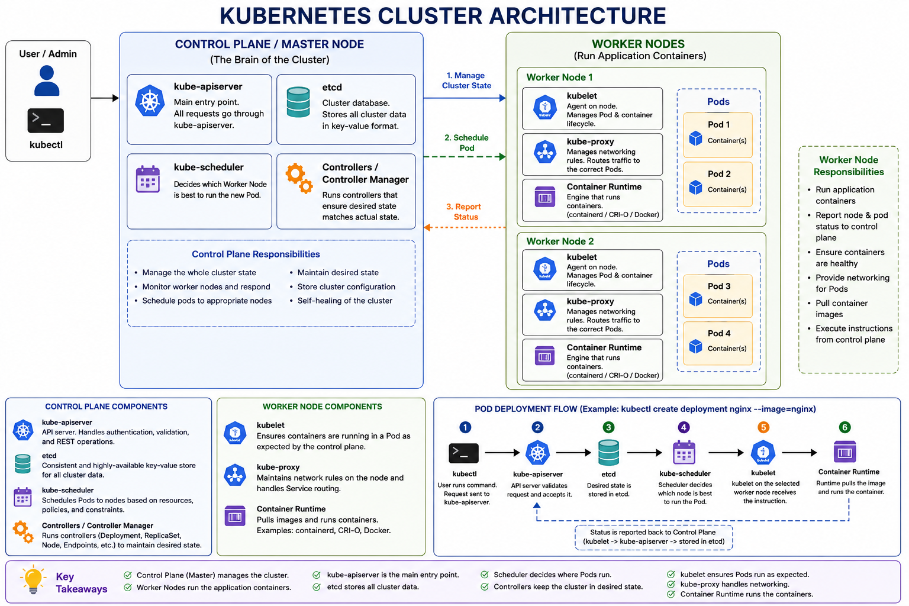
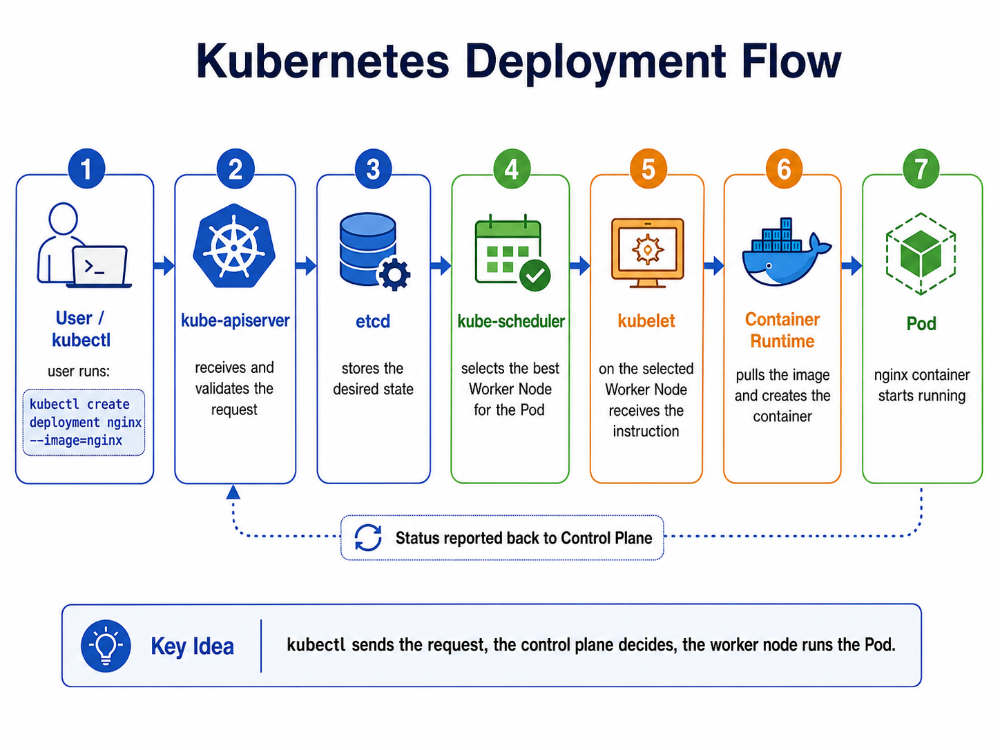

# Kubernetes Cluster Architecture - Note

> This note explains the Kubernetes Cluster Architecture in Myanmar language, with English visual diagrams for easier understanding.

---

## 1. အကျဉ်းချုပ်

**Kubernetes Cluster Architecture** ဆိုတာ Kubernetes cluster တစ်ခုထဲမှာ application containers တွေကို ဘယ်လို run မလဲ၊ ဘယ်လို manage လုပ်မလဲ၊ ဘယ်လို monitor လုပ်မလဲဆိုတာကို သတ်မှတ်ထားတဲ့ ဖွဲ့စည်းပုံဖြစ်ပါတယ်။

အလွယ်မှတ်ရင် -

```text
Control Plane / Master Node = Cluster ကို စီမံခန့်ခွဲတဲ့ ဦးနှောက်
Worker Node = Application containers တွေကို တကယ် run ပေးတဲ့ machine
```

Kubernetes မှာ application တွေကို တိုက်ရိုက် container အနေနဲ့ run တာမဟုတ်ဘဲ **Pod** ထဲမှာ container ကိုထည့်ပြီး Worker Node ပေါ်မှာ run စေပါတယ်။ Control Plane ကတော့ cluster တစ်ခုလုံးကို စီမံခန့်ခွဲပေးပါတယ်။

---

## 2. Ship Analogy ဖြင့်နားလည်ခြင်း

Kubernetes cluster ကို သင်္ဘောဆိပ်ကမ်းတစ်ခုလို စဉ်းစားနိုင်ပါတယ်။

| Kubernetes Term             | Ship Analogy    | Meaning                                             |
| --------------------------- | --------------- | --------------------------------------------------- |
| Control Plane / Master Node | Command Center  | ဆိပ်ကမ်းတစ်ခုလုံးကို စီမံခန့်ခွဲတဲ့နေရာ             |
| Worker Node                 | Cargo Ship      | Containers တွေကို တကယ်သယ်ဆောင်/run ပေးတဲ့ machine   |
| Containerized Application   | Cargo Container | Application ကို package လုပ်ထားတဲ့ container        |
| Pod                         | Container Group | Container တစ်ခု သို့မဟုတ် အများကြီးကိုစုထားတဲ့ unit |

Master Node က application ကို တိုက်ရိုက် run မပေးပါ။ ဘယ် application ကို ဘယ် Worker Node ပေါ်မှာ run မလဲ၊ crash ဖြစ်ရင် ဘယ်လိုပြန်ထောင်မလဲ၊ desired state ပြည့်အောင် ဘယ်လိုထိန်းမလဲဆိုတာကို စီမံပေးပါတယ်။

---

## 3. Kubernetes Cluster Architecture Visual Diagram



---

## 4. Master Node / Control Plane

**Master Node** သို့မဟုတ် **Control Plane** က Kubernetes cluster ရဲ့ central command center ဖြစ်ပါတယ်။ Cluster တစ်ခုလုံးကို စောင့်ကြည့်ပြီး Worker Node တွေကို ညွှန်ကြားပေးပါတယ်။

Control Plane ၏ အဓိကတာဝန်များ -

- Cluster တစ်ခုလုံး၏ state ကို manage လုပ်ခြင်း
- Worker Node များ၏ health နှင့် status ကို စောင့်ကြည့်ခြင်း
- Pod အသစ်များကို ဘယ် node ပေါ်မှာ run မလဲ ဆုံးဖြတ်ခြင်း
- Desired state နှင့် actual state ကို နှိုင်းယှဉ်ပြီး ပြန်ညှိခြင်း
- Cluster configuration နှင့် resource information များကို သိမ်းဆည်းခြင်း

ဥပမာ - Deployment တစ်ခုမှာ replicas 3 လုံးလိုတယ်လို့ သတ်မှတ်ထားပေမယ့် တကယ် run နေတာ 2 လုံးပဲရှိရင် Control Plane က နောက်ထပ် Pod တစ်လုံး create လုပ်အောင် စီမံပေးပါတယ်။

---

## 5. Control Plane Components

### 5.1 kube-apiserver

**kube-apiserver** က Kubernetes cluster ၏ main entry point ဖြစ်ပါတယ်။ User က `kubectl` command run လုပ်တိုင်း request က kube-apiserver ဆီကို အရင်သွားပါတယ်။

```text
kubectl -> kube-apiserver -> Kubernetes Cluster
```

ဥပမာ command များ -

```bash
kubectl get nodes
kubectl create deployment nginx --image=nginx
kubectl delete pod mypod
```

kube-apiserver က request ကို လက်ခံပြီး authentication, validation လုပ်ကာ အခြား Kubernetes components တွေနဲ့ ဆက်သွယ်ပေးပါတယ်။

---

### 5.2 etcd

**etcd** က Kubernetes cluster ၏ database သို့မဟုတ် memory လိုအလုပ်လုပ်ပါတယ်။ Cluster-wide configuration နှင့် current state data တွေကို key-value format နဲ့ သိမ်းထားပါတယ်။

etcd ထဲမှာ သိမ်းထားနိုင်သောအရာများ -

- ဘယ် Nodes တွေရှိလဲ
- ဘယ် Pods တွေ run နေလဲ
- Deployments, Services, ConfigMaps, Secrets စတဲ့ resources တွေရဲ့ state
- Desired state နှင့် actual state information

မှတ်ရန် -

```text
etcd = Kubernetes cluster ရဲ့ single source of truth
```

---

### 5.3 kube-scheduler

**kube-scheduler** က Pod အသစ်တစ်ခုကို ဘယ် Worker Node ပေါ်မှာ run မလဲ ဆုံးဖြတ်ပေးတဲ့ component ဖြစ်ပါတယ်။

Scheduler စဉ်းစားသည့်အချက်များ -

- Node မှာ CPU နှင့် memory လုံလောက်လား
- Pod resource request ကို node က လက်ခံနိုင်လား
- Node taint နှင့် Pod toleration ကိုက်ညီလား
- Node affinity / anti-affinity rules တွေကိုက်ညီလား
- Node ပေါ်မှာ workload များနေလား

အရေးကြီးမှတ်ရန် -

```text
Scheduler does not run containers.
Scheduler only chooses the best Worker Node for a Pod.
```

---

### 5.4 Controller Manager

**Controllers** တွေက Kubernetes cluster ထဲမှာ desired state နဲ့ actual state ကို အမြဲတိုက်စစ်ပြီး မကိုက်ညီရင် ပြန်ပြင်ပေးတဲ့ components ဖြစ်ပါတယ်။

ဥပမာ -

```text
Desired state = nginx pod 3 လုံး
Actual state  = nginx pod 2 လုံး
Controller action = နောက်ထပ် pod 1 လုံး create လုပ်ရန် စီမံခြင်း
```

Controllers မရှိရင် Kubernetes ရဲ့ self-healing behavior လည်း ပြည့်စုံနိုင်မှာမဟုတ်ပါ။

---

## 6. Worker Node

**Worker Node** က containerized applications တွေကို တကယ် run ပေးတဲ့ machine ဖြစ်ပါတယ်။ Worker Node သည် physical server ဖြစ်နိုင်သလို virtual machine သို့မဟုတ် cloud instance လည်း ဖြစ်နိုင်ပါတယ်။

Worker Node ထဲမှာ အဓိက components ၃ခုရှိပါတယ်။

```text
1. kubelet
2. kube-proxy
3. container runtime
```

---

## 7. Worker Node Components

### 7.1 kubelet

**kubelet** က Worker Node တစ်လုံးချင်းစီမှာရှိတဲ့ agent ဖြစ်ပါတယ်။ Control Plane မှ instruction ကို လက်ခံပြီး Pod နှင့် container lifecycle ကို manage လုပ်ပါတယ်။

kubelet ၏တာဝန်များ -

- kube-apiserver မှ instruction လက်ခံခြင်း
- Pod/container များ run ပေးခြင်း
- Container image pull လုပ်ခြင်း
- Container create, update, delete လုပ်ခြင်း
- Node နှင့် Pod health status ကို Control Plane ဆီ report ပြန်ပေးခြင်း

ဥပမာ - Control Plane က worker node တစ်ခုပေါ်မှာ nginx pod run လုပ်ရန်ပြောလိုက်လျှင် kubelet က container runtime ကိုခိုင်းပြီး nginx container ကို run စေပါတယ်။

---

### 7.2 kube-proxy

**kube-proxy** က Worker Node ပေါ်မှာ networking rules တွေကို configure လုပ်ပေးပါတယ်။ Service traffic ကို မှန်ကန်တဲ့ Pod တွေဆီ route လုပ်ဖို့ အရေးကြီးပါတယ်။

kube-proxy ၏တာဝန်များ -

- Pod တွေအချင်းချင်း communicate လုပ်နိုင်အောင် ကူညီခြင်း
- Service traffic ကို backend Pods တွေဆီ ပို့ပေးခြင်း
- Node ပေါ်မှာ network rules များ configure လုပ်ခြင်း

ဥပမာ - web app pod က database service ကိုခေါ်သောအခါ kube-proxy က traffic routing အတွက် ပါဝင်ကူညီပါတယ်။

---

### 7.3 Container Runtime

**Container Runtime** က container ကို တကယ် run ပေးတဲ့ engine ဖြစ်ပါတယ်။ Kubernetes ကိုယ်တိုင် container ကို directly run မလုပ်ပါ။ kubelet က container runtime ကိုအသုံးပြုပြီး container ကို run စေပါတယ်။

အသုံးများသော container runtimes -

- containerd
- CRI-O
- Docker

---

## 8. Deployment တစ်ခု Create လုပ်သောအခါ Flow

ဥပမာ `nginx` deployment တစ်ခု create လုပ်မယ်ဆိုပါစို့။

```bash
kubectl create deployment nginx --image=nginx
```

ဒီ command run လိုက်တဲ့အခါ Kubernetes ထဲမှာ အောက်ပါ flow အတိုင်း အလုပ်လုပ်ပါတယ်။

1. `kubectl` က request ကို `kube-apiserver` ဆီပို့တယ်။
2. `kube-apiserver` က request ကိုလက်ခံပြီး validate လုပ်တယ်။
3. Desired state ကို `etcd` ထဲမှာ သိမ်းတယ်။
4. `kube-scheduler` က Pod ကို ဘယ် Worker Node ပေါ်တင်မလဲ ဆုံးဖြတ်တယ်။
5. ရွေးချယ်ခံရတဲ့ Worker Node ပေါ်က `kubelet` က instruction လက်ခံတယ်။
6. `kubelet` က `container runtime` ကိုခိုင်းပြီး nginx container ကို run စေတယ်။
7. `kube-proxy` က networking နှင့် service communication အတွက် rules တွေ manage လုပ်တယ်။

### Deployment Flow Diagram Image



---

## 9. Master Node နှင့် Worker Node နှိုင်းယှဉ်ချက်

| အပိုင်း                     | အဓိကအလုပ်                                                   |
| --------------------------- | ----------------------------------------------------------- |
| Master Node / Control Plane | Cluster တစ်ခုလုံးကို စီမံခန့်ခွဲသည်                         |
| kube-apiserver              | Kubernetes API request များဝင်ရာ main gateway ဖြစ်သည်       |
| etcd                        | Cluster configuration နှင့် state data သိမ်းဆည်းသည်         |
| kube-scheduler              | Pod ကို ဘယ် Worker Node ပေါ်မှာ run မလဲ ဆုံးဖြတ်သည်         |
| Controller Manager          | Desired state ပြည့်အောင် စောင့်ကြည့်/ပြုပြင်သည်             |
| Worker Node                 | Application containers များကို တကယ် run ပေးသည်              |
| kubelet                     | Worker Node ပေါ်က Pod lifecycle ကို manage လုပ်သည်          |
| kube-proxy                  | Service networking နှင့် traffic routing ကို manage လုပ်သည် |
| Container Runtime           | Container ကို တကယ် run ပေးသည်                               |

---

## 10. CKA အတွက် မှတ်ထားရန် Key Points

```text
Control Plane = စီမံခန့်ခွဲသူ
Worker Node = အလုပ်လုပ်သူ
API Server = ဝင်ပေါက်
etcd = မှတ်ဉာဏ် / database
Scheduler = နေရာချသူ
Controller = စောင့်ကြည့်/ပြုပြင်သူ
kubelet = node ပေါ်က agent
kube-proxy = network traffic manager
Container Runtime = container run ပေးတဲ့ engine
```

---

## 11. Useful kubectl Commands

### Nodes ကြည့်ရန်

```bash
kubectl get nodes
```

### Pods ကြည့်ရန်

```bash
kubectl get pods
```

### Deployment create လုပ်ရန်

```bash
kubectl create deployment nginx --image=nginx
```

### Deployment status ကြည့်ရန်

```bash
kubectl get deployments
```

### Pod အသေးစိတ်ကြည့်ရန်

```bash
kubectl describe pod <pod-name>
```

### Pod logs ကြည့်ရန်

```bash
kubectl logs <pod-name>
```

---

## 12. နိဂုံးချုပ်

Kubernetes architecture မှာ **Control Plane** က “ဘာဖြစ်ရမယ်” ဆိုတဲ့ desired state ကို စီမံပြီး **Worker Node** တွေက application containers တွေကို တကယ် run ပေးပါတယ်။

`kube-apiserver`, `etcd`, `kube-scheduler`, `controller manager`, `kubelet`, `kube-proxy`, `container runtime` တို့ရဲ့ အလုပ်လုပ်ပုံကို နားလည်ထားရင် Kubernetes cluster troubleshooting နှင့် CKA lab tasks တွေကို ပိုပြီးလွယ်ကူစွာ လုပ်နိုင်ပါတယ်။

---

## 13. Quick Memory Formula

```text
kubectl talks to API Server.
API Server stores state in etcd.
Scheduler chooses the node.
Controller keeps desired state.
kubelet runs Pods using container runtime.
kube-proxy manages networking.
```
