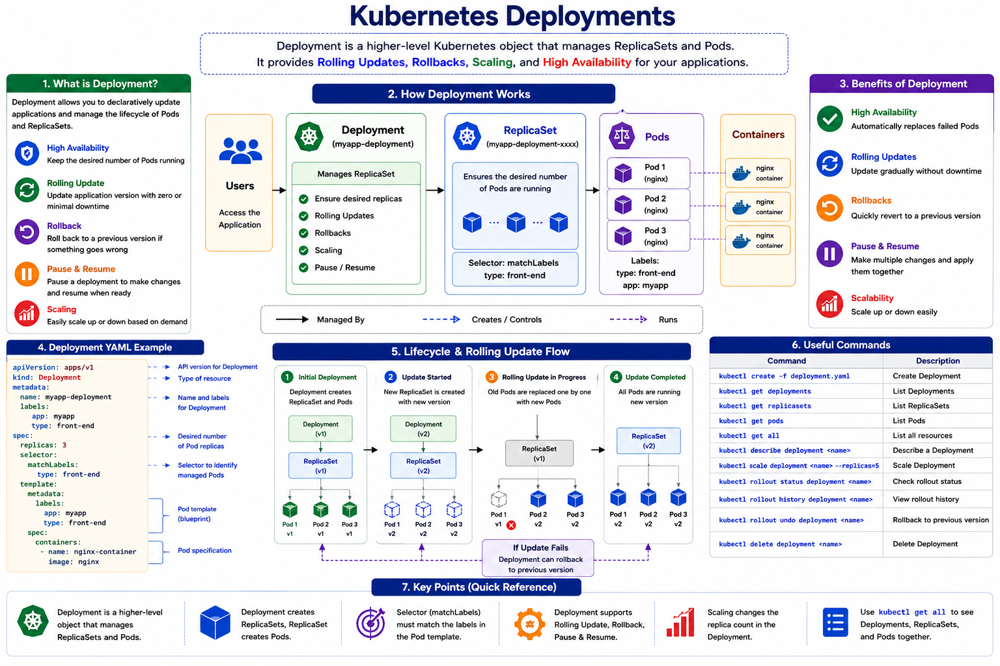

# Kubernetes Deployments Note

> This note explains Kubernetes Deployments in Myanmar language with an English visual diagram.

---

## Visual Diagram



---

## 1. Deployment ဆိုတာဘာလဲ?

**Deployment** ဆိုတာ Kubernetes ထဲမှာ application ကို production environment မှာ manage လုပ်ဖို့သုံးတဲ့ **higher-level object** ဖြစ်ပါတယ်။

Deployment က Pod တွေကို တိုက်ရိုက် manage မလုပ်ဘဲ **ReplicaSet** ကို create/manage လုပ်ပြီး ReplicaSet ကမှ Pod တွေကို run စေပါတယ်။

အလွယ်မှတ်ရန် -

```text
Deployment → ReplicaSet → Pods → Containers
```

ဆိုလိုတာက Deployment က application version, replicas, update, rollback စတာတွေကို control လုပ်ပေးတဲ့ object ဖြစ်ပါတယ်။

---

## 2. Deployment ကိုဘာကြောင့်သုံးလဲ?

Deployment ကို သုံးရတဲ့ အဓိကအကြောင်းရင်းတွေက -

| Feature | Meaning |
|---|---|
| High Availability | Application instances အများကြီး run နိုင်သည် |
| Load Balancing | User traffic ကို Pods အများကြီးကြား ခွဲနိုင်သည် |
| Rolling Update | App version ကို downtime နည်းနည်းနဲ့ ဖြည်းဖြည်းချင်း update လုပ်နိုင်သည် |
| Rollback | Update မှားသွားရင် previous version ကိုပြန်သွားနိုင်သည် |
| Pause / Resume | Update process ကိုခဏရပ်ပြီး ပြန်ဆက်နိုင်သည် |
| ReplicaSet Management | Deployment က ReplicaSet ကို automatically manage လုပ်ပေးသည် |

အလွယ်မှတ်ရန် -

```text
Deployment = Application update and management controller
```

---

## 3. Pod, ReplicaSet, Deployment ကွာခြားချက်

| Object | အလုပ် |
|---|---|
| Pod | Container run တဲ့ smallest deployable unit |
| ReplicaSet | Pod replicas အရေအတွက်ကို ထိန်းပေးသည် |
| Deployment | ReplicaSet ကို manage လုပ်ပြီး rolling update, rollback စတာတွေ ပေးသည် |

မှတ်ရန် -

```text
Pod = run container
ReplicaSet = keep number of Pods
Deployment = manage ReplicaSet + updates
```

---

## 4. Deployment အလုပ်လုပ်ပုံ

Deployment တစ်ခု create လုပ်လိုက်ရင် Kubernetes က အောက်ပါအတိုင်း အလုပ်လုပ်ပါတယ်။

```text
User creates Deployment
        ↓
Deployment creates ReplicaSet
        ↓
ReplicaSet creates Pods
        ↓
Pods run containers
```

ဥပမာ Deployment ထဲမှာ `replicas: 3` လို့သတ်မှတ်ထားရင် -

```text
Deployment
   ↓
ReplicaSet
   ↓
Pod 1
Pod 2
Pod 3
```

Deployment က ReplicaSet ကို manage လုပ်ပြီး ReplicaSet က Pods ၃လုံး run နေဖို့ ထိန်းပေးပါတယ်။

---

## 5. Deployment YAML Structure

Deployment YAML file မှာ အဓိက fields ၄ခုပါပါတယ်။

```yaml
apiVersion:
kind:
metadata:
spec:
```

Deployment အတွက် -

```yaml
apiVersion: apps/v1
kind: Deployment
```

ဖြစ်ရပါမယ်။

---

## 6. Deployment YAML Example

```yaml
apiVersion: apps/v1
kind: Deployment
metadata:
  name: myapp-deployment
  labels:
    app: myapp
    type: front-end
spec:
  replicas: 3
  selector:
    matchLabels:
      type: front-end
  template:
    metadata:
      labels:
        app: myapp
        type: front-end
    spec:
      containers:
        - name: nginx-container
          image: nginx
```

---

## 7. YAML ထဲက အရေးကြီးတဲ့ Parts

### `replicas`

```yaml
replicas: 3
```

ဒါက Pod ဘယ်နှလုံး run မလဲဆိုတာ သတ်မှတ်တာပါ။

### `selector`

```yaml
selector:
  matchLabels:
    type: front-end
```

Deployment က ဘယ် Pods တွေကို manage လုပ်မလဲဆိုတာ selector နဲ့ရွေးပါတယ်။

### `template`

```yaml
template:
  metadata:
    labels:
      app: myapp
      type: front-end
```

Template က Pod အသစ် create လုပ်ဖို့ blueprint ဖြစ်ပါတယ်။

### `containers`

```yaml
containers:
  - name: nginx-container
    image: nginx
```

ဒီနေရာမှာ Pod ထဲမှာ run မယ့် container name နဲ့ image ကိုသတ်မှတ်ပါတယ်။

---

## 8. Deployment Create လုပ်နည်း

YAML file ကို `deployment-definition.yml` လို့ save လုပ်ထားမယ်ဆိုရင် -

```bash
kubectl create -f deployment-definition.yml
```

Output ဥပမာ -

```text
deployment "myapp-deployment" created
```

---

## 9. Deployment စစ်နည်း

Deployment list ကြည့်ရန် -

```bash
kubectl get deployments
```

Output ဥပမာ -

```text
NAME                DESIRED   CURRENT   UP-TO-DATE   AVAILABLE   AGE
myapp-deployment    3         3         3            3           21s
```

ဒီ output မှာ -

| Column | Meaning |
|---|---|
| DESIRED | လိုချင်တဲ့ replicas အရေအတွက် |
| CURRENT | လက်ရှိ create ဖြစ်နေတဲ့ replicas |
| UP-TO-DATE | latest version နဲ့ run နေတဲ့ replicas |
| AVAILABLE | user traffic လက်ခံနိုင်တဲ့ replicas |
| AGE | resource create လုပ်ထားတဲ့အချိန် |

---

## 10. Deployment Create လုပ်ပြီးနောက် Behind the Scenes

Deployment create လုပ်လိုက်ရင် ReplicaSet တစ်ခု automatically create ဖြစ်ပါတယ်။

ReplicaSet ကြည့်ရန် -

```bash
kubectl get replicasets
```

Pods ကြည့်ရန် -

```bash
kubectl get pods
```

အားလုံးကိုတစ်ခါတည်းကြည့်ရန် -

```bash
kubectl get all
```

`kubectl get all` နဲ့ကြည့်ရင် Deployment, ReplicaSet, Pods စတာတွေကို တစ်ခါတည်းမြင်နိုင်ပါတယ်။

---

## 11. Deployment Visual Flow

```text
kubectl create -f deployment-definition.yml
                ↓
          Deployment created
                ↓
          ReplicaSet created
                ↓
          Pods created
                ↓
          Containers running
```

အလွယ်မှတ်ရန် -

```text
Deployment does not directly run containers.
Deployment manages ReplicaSet.
ReplicaSet manages Pods.
Pods run containers.
```

---

## 12. Deployment ရဲ့ အရေးကြီး Features

### 12.1 Rolling Update

Rolling Update ဆိုတာ application version အသစ်ကို Pod တွေကို တစ်ပြိုင်နက်မပြောင်းဘဲ တစ်လုံးချင်းစီ ဖြည်းဖြည်းချင်း update လုပ်တာပါ။

```text
Old Pod 1 → New Pod 1
Old Pod 2 → New Pod 2
Old Pod 3 → New Pod 3
```

ဒီလိုလုပ်ခြင်းအားဖြင့် downtime နည်းနိုင်ပါတယ်။

### 12.2 Rollback

Update လုပ်ပြီး error ဖြစ်သွားရင် previous version ကို ပြန်သွားနိုင်ပါတယ်။

```text
New version failed
        ↓
Rollback to previous version
```

### 12.3 Pause and Resume

Deployment update process ကို ခဏရပ်ထားပြီး ပြင်ဆင်မှုတွေကို စုပြီးမှ ပြန်ဆက်နိုင်ပါတယ်။

```text
Pause → Make changes → Resume
```

---

## 13. Common Commands

| Task | Command |
|---|---|
| Create Deployment from YAML | `kubectl create -f deployment-definition.yml` |
| Get Deployments | `kubectl get deployments` |
| Get ReplicaSets | `kubectl get replicasets` |
| Get Pods | `kubectl get pods` |
| Get All Resources | `kubectl get all` |
| Describe Deployment | `kubectl describe deployment <deployment-name>` |
| Scale Deployment | `kubectl scale deployment <deployment-name> --replicas=5` |
| Check Rollout Status | `kubectl rollout status deployment <deployment-name>` |
| View Rollout History | `kubectl rollout history deployment <deployment-name>` |
| Rollback Deployment | `kubectl rollout undo deployment <deployment-name>` |
| Delete Deployment | `kubectl delete deployment <deployment-name>` |

---

## 14. CKA Exam မှာ မှတ်ရမယ့်အချက်များ

```text
Deployment uses apiVersion: apps/v1
Deployment manages ReplicaSets
ReplicaSet manages Pods
Deployment supports rolling updates and rollbacks
Deployment YAML is similar to ReplicaSet YAML
kind must be Deployment
selector.matchLabels must match template labels
kubectl get all shows Deployment, ReplicaSet, and Pods
```

---

## 15. Final Summary

Deployment ဆိုတာ Kubernetes application management အတွက် အရေးကြီးတဲ့ object ဖြစ်ပါတယ်။ Pod တွေကို တိုက်ရိုက် manage မလုပ်ဘဲ ReplicaSet ကို manage လုပ်ပြီး desired number of Pods ကို run စေပါတယ်။ Deployment ကိုသုံးခြင်းအားဖြင့် high availability, rolling update, rollback, pause/resume စတဲ့ production-level features တွေကို အသုံးပြုနိုင်ပါတယ်။ CKA exam အတွက် `Deployment → ReplicaSet → Pod` ဆိုတဲ့ relationship ကို သေချာမှတ်ထားရပါမယ်။
