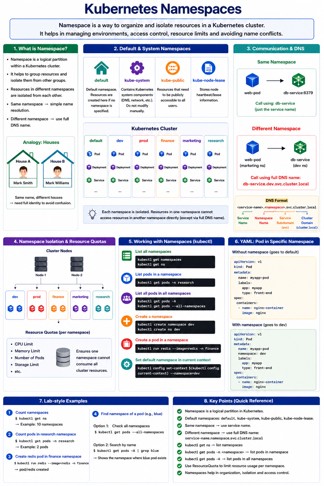

# Kubernetes Namespaces Note

> This note explains Kubernetes Namespaces in Myanmar language with an English visual diagram for easier CKA exam memory.

---

## 1. Namespace ဆိုတာဘာလဲ?

**Namespace** ဆိုတာ Kubernetes cluster ထဲမှာ resources တွေကို အုပ်စုခွဲပြီး သီးခြားစီ manage လုပ်ဖို့သုံးတဲ့ logical space ဖြစ်ပါတယ်။

အလွယ်မှတ်ရန် -

```text
Namespace = Kubernetes resources တွေကို ခွဲထားတဲ့ virtual room / house
```

ဥပမာ cluster တစ်ခုထဲမှာ environment အမျိုးမျိုးထားနိုင်ပါတယ်။

```text
dev namespace
prod namespace
finance namespace
marketing namespace
research namespace
```

Namespace တစ်ခုစီထဲမှာ Pod, Deployment, Service စတဲ့ resources တွေကို သီးခြားထားနိုင်ပါတယ်။

---

## 2. Namespace ကိုဘာကြောင့်သုံးလဲ?

Namespace ကို အဓိကအားဖြင့် resources တွေကို စနစ်တကျခွဲထားရန်၊ environment တစ်ခုနဲ့တစ်ခု isolate လုပ်ရန်၊ access control ခွဲရန်၊ resource usage ကို limit သတ်မှတ်ရန် အသုံးပြုပါတယ်။

| Purpose | Meaning |
|---|---|
| Resource Organization | Resources တွေကို project/environment အလိုက်ခွဲထားနိုင်သည် |
| Isolation | Dev, Prod စတဲ့ environment တွေကို သီးခြားထားနိုင်သည် |
| Access Control | Namespace တစ်ခုချင်းစီအတွက် permission ခွဲနိုင်သည် |
| Resource Limit | CPU, memory, pods count စတာတွေကို limit သတ်မှတ်နိုင်သည် |
| Name Conflict Avoidance | Namespace မတူရင် resource name တူလည်းရနိုင်သည် |

ဥပမာ `dev` namespace ထဲမှာ `redis` pod ရှိနိုင်သလို `prod` namespace ထဲမှာလည်း `redis` pod ရှိနိုင်ပါတယ်။ Namespace မတူတဲ့အတွက် conflict မဖြစ်ပါဘူး။

```text
dev/redis
prod/redis
```

---

## 3. Default Namespace များ

Kubernetes cluster create လုပ်ပြီးချင်းမှာ default namespaces တချို့ပါပြီးသားဖြစ်ပါတယ်။

| Namespace | Meaning |
|---|---|
| `default` | Namespace မ指定ရင် resources တွေ create ဖြစ်တဲ့နေရာ |
| `kube-system` | Kubernetes system components တွေရှိတဲ့နေရာ |
| `kube-public` | Cluster-wide public resources တွေအတွက် |
| `kube-node-lease` | Node heartbeat/lease information တွေအတွက် |

အရေးကြီးမှတ်ရန် -

```text
Namespace မထည့်ဘဲ resource create လုပ်ရင် default namespace ထဲမှာ create ဖြစ်တယ်။
```

---

## 4. Namespace Analogy

Namespace ကို အိမ်တစ်လုံးချင်းစီလို စဉ်းစားနိုင်ပါတယ်။ အိမ်တစ်လုံးထဲမှာရှိတဲ့လူတွေက first name နဲ့ခေါ်လို့ရပေမယ့် အိမ်မတူရင် full name နဲ့ခေါ်ရသလို Kubernetes မှာလည်း namespace မတူတဲ့ Service ကိုခေါ်ချင်ရင် full DNS name သုံးရပါတယ်။

```text
House A = dev namespace
House B = prod namespace
House C = finance namespace
```

---

## 5. Same Namespace ထဲက Communication

Resource တွေဟာ namespace တူနေရင် simple service name နဲ့ခေါ်နိုင်ပါတယ်။

ဥပမာ `marketing` namespace ထဲမှာ `blue` pod နဲ့ `db-service` service နှစ်ခုလုံးရှိတယ်ဆိုရင် `blue` application က database ကို ဒီလိုခေါ်နိုင်ပါတယ်။

```text
db-service
```

Port ပါခေါ်မယ်ဆိုရင် -

```text
db-service:6379
```

---

## 6. Different Namespace ထဲက Communication

Namespace မတူတဲ့ service ကိုခေါ်ချင်ရင် full DNS name သုံးရပါတယ်။

Format -

```text
<service-name>.<namespace>.svc.cluster.local
```

ဥပမာ `blue` application က `marketing` namespace ထဲမှာရှိပြီး `db-service` က `dev` namespace ထဲမှာရှိတယ်ဆိုပါစို့။ ခေါ်ရမယ့် DNS name က -

```text
db-service.dev.svc.cluster.local
```

အလွယ်မှတ်ရန် -

```text
Same namespace       → service-name
Different namespace  → service-name.namespace.svc.cluster.local
```

---

## 7. Visual Diagram



---

## 8. Namespace ကြည့်နည်း

Namespaces list ကြည့်ရန် -

```bash
kubectl get namespaces
```

Short command -

```bash
kubectl get ns
```

Example output -

```text
NAME              STATUS   AGE
default           Active   6m
kube-system       Active   6m
kube-public       Active   6m
kube-node-lease   Active   6m
dev               Active   1m
prod              Active   1m
finance           Active   1m
marketing         Active   1m
research          Active   1m
```

---

## 9. Namespace တစ်ခုထဲက Pods ကြည့်နည်း

Default namespace ထဲက pods ကြည့်ရန် -

```bash
kubectl get pods
```

Specific namespace ထဲက pods ကြည့်ရန် -

```bash
kubectl get pods --namespace=research
```

Short form -

```bash
kubectl get pods -n research
```

All namespaces ထဲက pods အားလုံးကြည့်ရန် -

```bash
kubectl get pods --all-namespaces
```

သို့မဟုတ် -

```bash
kubectl get pods -A
```

---

## 10. Namespace တစ်ခုထဲမှာ Pod Create လုပ်နည်း

ဥပမာ `finance` namespace ထဲမှာ `redis` pod create လုပ်မယ်ဆိုရင် -

```bash
kubectl run redis --image=redis -n finance
```

စစ်ရန် -

```bash
kubectl get pods -n finance
```

Example output -

```text
NAME      READY   STATUS              RESTARTS   AGE
payroll   1/1     Running             0          2m
redis     0/1     ContainerCreating   0          8s
```

---

## 11. YAML ထဲမှာ Namespace ထည့်နည်း

Namespace မထည့်ထားတဲ့ Pod YAML -

```yaml
apiVersion: v1
kind: Pod
metadata:
  name: myapp-pod
  labels:
    app: myapp
    type: front-end
spec:
  containers:
    - name: nginx-container
      image: nginx
```

ဒီ YAML ကို apply လုပ်ရင် default namespace ထဲမှာ create ဖြစ်မယ်။

Namespace ထည့်ထားတဲ့ Pod YAML -

```yaml
apiVersion: v1
kind: Pod
metadata:
  name: myapp-pod
  namespace: dev
  labels:
    app: myapp
    type: front-end
spec:
  containers:
    - name: nginx-container
      image: nginx
```

ဒီ YAML ကို apply လုပ်ရင် `dev` namespace ထဲမှာ create ဖြစ်မယ်။

---

## 12. Namespace Create လုပ်နည်း

Command နဲ့ namespace create လုပ်ရန် -

```bash
kubectl create namespace dev
```

Short form -

```bash
kubectl create ns dev
```

YAML file နဲ့ create လုပ်ရန် -

```yaml
apiVersion: v1
kind: Namespace
metadata:
  name: dev
```

Apply/Create -

```bash
kubectl create -f namespace-dev.yml
```

---

## 13. Current Context ရဲ့ Default Namespace ပြောင်းနည်း

Command တိုင်းမှာ `-n dev` ထည့်မရေးချင်ရင် current context ရဲ့ namespace ကိုပြောင်းထားနိုင်ပါတယ်။

```bash
kubectl config set-context $(kubectl config current-context) --namespace=dev
```

ပြီးရင် -

```bash
kubectl get pods
```

ဒီ command က `dev` namespace ထဲက pods တွေကိုပြပါမယ်။

---

## 14. ResourceQuota ဆိုတာဘာလဲ?

**ResourceQuota** ဆိုတာ namespace တစ်ခုထဲမှာ resources တွေ ဘယ်လောက်အထိသုံးခွင့်ရှိမလဲဆိုတာ limit သတ်မှတ်တဲ့ object ဖြစ်ပါတယ်။

ဥပမာ `dev` namespace ထဲမှာ -

```yaml
apiVersion: v1
kind: ResourceQuota
metadata:
  name: compute-quota
  namespace: dev
spec:
  hard:
    pods: "10"
    requests.cpu: "4"
    requests.memory: 5Gi
    limits.cpu: "10"
    limits.memory: 10Gi
```

ဒီ quota က `dev` namespace ထဲမှာ -

```text
maximum pods = 10
CPU requests = 4
Memory requests = 5Gi
CPU limits = 10
Memory limits = 10Gi
```

ဆိုပြီး limit သတ်မှတ်ပေးပါတယ်။

Apply လုပ်ရန် -

```bash
kubectl create -f compute-quota.yaml
```

---

## 15. Lab-style Examples

### Example 1: Namespace အရေအတွက်စစ်ရန်

```bash
kubectl get ns
```

### Example 2: `research` namespace ထဲက Pods စစ်ရန်

```bash
kubectl get pods -n research
```

### Example 3: `finance` namespace ထဲမှာ Redis Pod create လုပ်ရန်

```bash
kubectl run redis --image=redis -n finance
```

### Example 4: Pod တစ်ခု ဘယ် namespace ထဲမှာရှိလဲရှာရန်

```bash
kubectl get pods --all-namespaces
```

သို့မဟုတ် -

```bash
kubectl get pods -A
```

---

## 16. Namespace DNS မှတ်ရန်

Same namespace ထဲက service ကိုခေါ်ရန် -

```text
db-service
```

Different namespace ထဲက service ကိုခေါ်ရန် -

```text
db-service.dev.svc.cluster.local
```

DNS format -

```text
service-name.namespace.svc.cluster.local
```

အပိုင်းတစ်ခုချင်းစီအဓိပ္ပါယ် -

| Part | Meaning |
|---|---|
| `db-service` | Service name |
| `dev` | Namespace name |
| `svc` | Service subdomain |
| `cluster.local` | Default cluster domain |

---

## 17. Useful Commands

| Task | Command |
|---|---|
| List namespaces | `kubectl get ns` |
| Create namespace | `kubectl create ns dev` |
| List pods in current namespace | `kubectl get pods` |
| List pods in specific namespace | `kubectl get pods -n dev` |
| List all pods in all namespaces | `kubectl get pods -A` |
| Create pod in namespace | `kubectl run redis --image=redis -n finance` |
| Get services in namespace | `kubectl get svc -n marketing` |
| Set default namespace | `kubectl config set-context $(kubectl config current-context) --namespace=dev` |
| Create from YAML in namespace | `kubectl create -f pod.yml -n dev` |

---

## 18. CKA Exam မှာ မှတ်ရမယ့်အချက်များ

```text
Namespace မထည့်ရင် default namespace ထဲမှာ create ဖြစ်တယ်။
kube-system ထဲမှာ Kubernetes system components တွေရှိတယ်။
kubectl get ns နဲ့ namespaces တွေကြည့်နိုင်တယ်။
-n <namespace> နဲ့ specific namespace ထဲက resources တွေကြည့်နိုင်တယ်။
-A သို့မဟုတ် --all-namespaces နဲ့ namespace အားလုံးကြည့်နိုင်တယ်။
Same namespace service ကို service name နဲ့ခေါ်နိုင်တယ်။
Different namespace service ကို service-name.namespace.svc.cluster.local နဲ့ခေါ်ရတယ်။
ResourceQuota နဲ့ namespace resource usage ကို limit သတ်မှတ်နိုင်တယ်။
```

---

## 19. Final Summary

Namespace ဆိုတာ Kubernetes cluster ထဲမှာ resources တွေကို logical group ခွဲပြီး manage လုပ်ဖို့သုံးတဲ့ object ဖြစ်ပါတယ်။ Development, production, finance, marketing စတဲ့ environment တွေကို cluster တစ်ခုထဲမှာ သီးခြားစီထားနိုင်ပါတယ်။ Same namespace ထဲက service ကို simple service name နဲ့ခေါ်နိုင်ပြီး namespace မတူရင် full DNS name `service-name.namespace.svc.cluster.local` ကိုသုံးရပါတယ်။ CKA exam အတွက် `kubectl get ns`, `kubectl get pods -n <namespace>`, `kubectl get pods -A`, `kubectl create ns`, DNS format, ResourceQuota concept တွေကို သေချာမှတ်ထားသင့်ပါတယ်။
