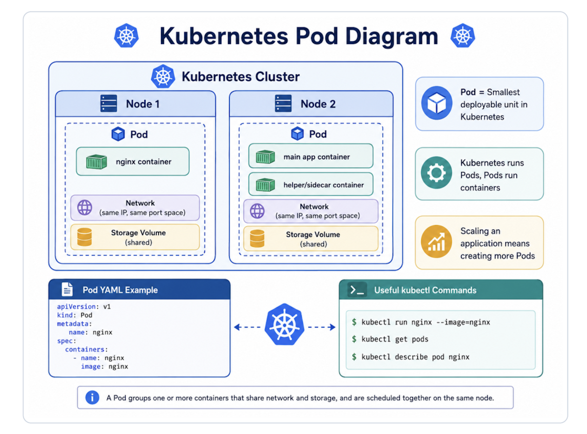

# CKA Core Concepts — Kubernetes Pods

> မြန်မာလိုရှင်းပြထားသော Kubernetes Pods Note ဖြစ်ပြီး diagram labels များကို English ဖြင့် ထည့်ထားသည်။

---

## 1. Pod ဆိုတာဘာလဲ?

**Pod** ဆိုတာ Kubernetes ထဲမှာ application ကို run ဖို့ အသုံးပြုတဲ့ **smallest deployable unit** ဖြစ်ပါတယ်။ Kubernetes က container ကို တိုက်ရိုက် run တာမဟုတ်ဘဲ container ကို **Pod ထဲမှာထည့်ပြီး run** စေပါတယ်။

အလွယ်မှတ်ရန် —

```text
Kubernetes runs Pods, and Pods run containers.
```

```text
Kubernetes → Pod → Container → Application
```

---

## 2. Pod နဲ့ Container ကဘာကွာလဲ?

**Container** က application process ကို run တဲ့ runtime unit ဖြစ်ပြီး **Pod** ကတော့ Kubernetes ထဲမှာ container ကို ထည့်သိမ်းပြီး manage လုပ်ပေးတဲ့ object ဖြစ်ပါတယ်။

| Item      | Meaning                                                                   |
| --------- | ------------------------------------------------------------------------- |
| Container | Application process ကို run တဲ့ unit                                      |
| Pod       | Container တစ်ခု သို့မဟုတ် အများကြီးကို group လုပ်ထားတဲ့ Kubernetes object |
| Node      | Pod တွေ run လုပ်တဲ့ worker machine                                        |
| Cluster   | Nodes တွေစုထားတဲ့ Kubernetes environment                                  |

အလွယ်မှတ်ရန် —

```text
Container = Application ကို run တဲ့ unit
Pod       = Container ကို Kubernetes ထဲမှာ manage လုပ်တဲ့ wrapper/object
```

---

## 3. Pod တစ်ခုထဲမှာ Container ဘယ်နှခုရှိနိုင်လဲ?

ပုံမှန်အားဖြင့် Pod တစ်ခုထဲမှာ **main application container တစ်ခု** ပါတာများပါတယ်။ ဒါပေမယ့် Pod တစ်ခုထဲမှာ container အများကြီးလည်း ထည့်နိုင်ပါတယ်။ Multi-container Pod တွေမှာ helper သို့မဟုတ် sidecar container တွေကို main app container ကို support လုပ်ဖို့ သုံးကြပါတယ်။

ဥပမာ —

```text
Pod
├── Main App Container: nginx
└── Helper/Sidecar Container: log-agent
```

---

## 4. Pod ထဲက Containers တွေ Share လုပ်တဲ့အရာများ

Pod တစ်ခုထဲမှာရှိတဲ့ containers တွေက network နဲ့ storage အချို့ကို share လုပ်နိုင်ပါတယ်။ ဒါကြောင့် same Pod ထဲက containers တွေက တစ်ခုနဲ့တစ်ခု `localhost` နဲ့ ဆက်သွယ်နိုင်ပါတယ်။

| Shared Item            | Explanation                                                    |
| ---------------------- | -------------------------------------------------------------- |
| Same Network Namespace | same IP address နဲ့ same port space ကို share လုပ်နိုင်သည်     |
| Shared Volumes         | same volume ကို mount လုပ်ပြီး file/data share လုပ်နိုင်သည်    |
| Same Lifecycle         | Pod အတွင်း containers တွေကို အတူတူ schedule/start/stop လုပ်သည် |

မှတ်ရန် —

```text
Same Pod ထဲက containers တွေသည် localhost ဖြင့် တစ်ခုနဲ့တစ်ခု ဆက်သွယ်နိုင်သည်။
```

---

## 5. Pod ကိုဘယ်လို Scale လုပ်လဲ?

Kubernetes မှာ application scale လုပ်ချင်ရင် **Pod အရေအတွက်ကို တိုးတာ** ဖြစ်ပါတယ်။ Container အရေအတွက်ကို Pod တစ်ခုထဲမှာ ထပ်ထည့်တာမဟုတ်ပါဘူး။

```text
Before scaling:
1 Pod running nginx

After scaling:
3 Pods running nginx
```

Exam Memory —

```text
Scaling an application means creating more Pods,
not adding more duplicate containers inside one Pod.
```

---

## 6. Pod Create လုပ်နည်း — Imperative Command

Pod ကို command တစ်ကြောင်းနဲ့ create လုပ်နိုင်ပါတယ်။

```bash
kubectl run nginx --image=nginx
```

Pod status ကြည့်ရန် —

```bash
kubectl get pods
```

Pod စ create လုပ်တဲ့အချိန်မှာ `ContainerCreating` ဖြစ်နိုင်ပြီး နောက်ပိုင်းမှာ `Running` ဖြစ်လာပါတယ်။

```text
NAME    READY   STATUS              RESTARTS   AGE
nginx   0/1     ContainerCreating   0          7s
```

နောက်တစ်ခါစစ်ရင် —

```text
NAME    READY   STATUS    RESTARTS   AGE
nginx   1/1     Running   0          9s
```

---

## 7. Pod Create လုပ်နည်း — YAML File

Kubernetes resource တွေကို YAML file နဲ့ရေးတဲ့အခါ အဓိက top-level fields ၄ခုကို သေချာသိထားရပါမယ်။

| Field        | Meaning                                                    |
| ------------ | ---------------------------------------------------------- |
| `apiVersion` | Kubernetes API version                                     |
| `kind`       | Resource type. Pod အတွက် `Pod` လို့ရေးသည်                  |
| `metadata`   | name, labels စတဲ့ resource information                     |
| `spec`       | Pod ထဲမှာ ဘာ container run မလဲဆိုတဲ့ desired configuration |

---

## 8. Pod YAML Example

```yaml
apiVersion: v1
kind: Pod
metadata:
  name: nginx
  labels:
    app: nginx
    tier: frontend
spec:
  containers:
    - name: nginx
      image: nginx
```

ဒီ YAML မှာ `containers` က list/array ဖြစ်တဲ့အတွက် dash `-` နဲ့ရေးပါတယ်။ Container တစ်ခုချင်းစီမှာ အနည်းဆုံး `name` နဲ့ `image` ပါရပါတယ်။

---

## 9. YAML File နဲ့ Pod Create လုပ်ခြင်း

YAML file ကို `pod.yaml` ဆိုပြီး save ပြီးရင် အောက်ပါ command နဲ့ create လုပ်နိုင်ပါတယ်။

```bash
kubectl apply -f pod.yaml
```

သို့မဟုတ် —

```bash
kubectl create -f pod.yaml
```

Pod status စစ်ရန် —

```bash
kubectl get pods
```

Pod အသေးစိတ်ကြည့်ရန် —

```bash
kubectl describe pod nginx
```

`kubectl describe` က Pod ရဲ့ node assignment, container status, event logs, image pulling, started status စတာတွေကို troubleshooting လုပ်တဲ့အခါ အသုံးဝင်ပါတယ်။

---

## 10. Pod Status တွေ

| Status              | Meaning                                                             |
| ------------------- | ------------------------------------------------------------------- |
| `Pending`           | Pod ကို schedule လုပ်နေသေးသည်။ Container မစသေးနိုင်ပါ               |
| `ContainerCreating` | Container image pull လုပ်နေသည် သို့မဟုတ် container create လုပ်နေသည် |
| `Running`           | Pod ထဲက container run နေပြီ                                         |
| `Succeeded`         | Task ပြီးဆုံးသွားပြီ                                                |
| `Failed`            | Pod/container error ဖြစ်သွားသည်                                     |
| `CrashLoopBackOff`  | Container crash ဖြစ်ပြီး Kubernetes က restart ထပ်လုပ်နေသည်          |
| `ImagePullBackOff`  | Container image pull မရပါ။ image name/tag/registry ကိုစစ်ရန်လိုသည်  |

---

## 11. Pod Troubleshooting Commands

```bash
# List Pods
kubectl get pods

# Describe a Pod
kubectl describe pod <pod-name>

# View Pod logs
kubectl logs <pod-name>

# Enter into a Pod
kubectl exec -it <pod-name> -- sh

# Delete a Pod
kubectl delete pod <pod-name>
```

---

## 12. CKA Exam မှာ Pods အတွက် မှတ်ရမယ့်အချက်များ

- Create Pod using `kubectl run`
- Create Pod using YAML
- Understand `apiVersion`, `kind`, `metadata`, `spec`
- Use labels in metadata
- Check Pod status using `kubectl get pods`
- Troubleshoot using `kubectl describe pod`
- Check logs using `kubectl logs`
- Understand single-container and multi-container Pods
- Know that scaling means increasing Pods, not containers inside one Pod

---

## 13. Quick Practice

```bash
# Create nginx Pod
kubectl run nginx --image=nginx

# Check Pod
kubectl get pods

# Describe Pod
kubectl describe pod nginx

# Delete Pod
kubectl delete pod nginx
```

---

## 14. Visual Diagram

Diagram labels are written in English for easier exam memory.



---

## 15. Final Summary

Pod ဆိုတာ Kubernetes မှာ application container ကို run ဖို့ သုံးတဲ့ အခြေခံအကျဆုံး object ဖြစ်ပါတယ်။ Container ကို Kubernetes က တိုက်ရိုက်မ run ဘဲ Pod ထဲမှာထည့်ပြီး run စေပါတယ်။ Pod တစ်ခုထဲမှာ container တစ်ခု သို့မဟုတ် အများကြီးပါနိုင်ပေမယ့် ပုံမှန်အားဖြင့် main container တစ်ခုပါတာများပါတယ်။ Application ကို scale လုပ်ချင်ရင် Pod အရေအတွက်ကို တိုးရပါတယ်။ Pod ကို command နဲ့လည်း create လုပ်နိုင်ပြီး YAML file နဲ့လည်း create လုပ်နိုင်ပါတယ်။ YAML file မှာ `apiVersion`, `kind`, `metadata`, `spec` ဆိုတဲ့ top-level fields ၄ခုကို သေချာနားလည်ထားရပါမယ်။

---

## 16. Quick Memory Formula

```text
Pod = Smallest deployable unit
Pod contains container(s)
Pod gets one IP address
Containers inside same Pod share network and storage
Scaling means creating more Pods
YAML needs apiVersion, kind, metadata, spec
```
