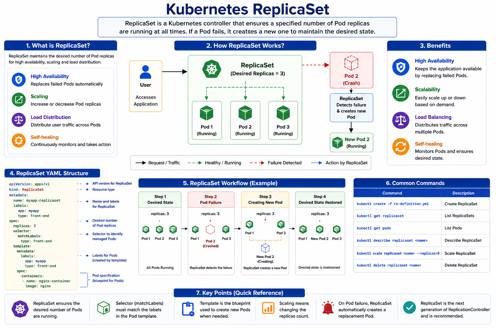

# Kubernetes ReplicaSet - Myanmar Note

> This note explains Kubernetes ReplicaSet in Myanmar language with an English visual diagram for easier CKA/Core Concepts review.

---

## Visual Diagram



---

## 1. ReplicaSet ဆိုတာဘာလဲ?

**ReplicaSet** ဆိုတာ Kubernetes ထဲမှာ Pod အရေအတွက်ကို သတ်မှတ်ထားတဲ့ desired state အတိုင်း အမြဲရှိနေအောင် ထိန်းပေးတဲ့ controller ဖြစ်ပါတယ်။

ဥပမာ `replicas: 3` လို့ သတ်မှတ်ထားရင် ReplicaSet က Pod ၃ လုံး အမြဲ run နေဖို့ စောင့်ကြည့်ပေးပါတယ်။ Pod တစ်လုံး crash ဖြစ်သွားရင် ReplicaSet က replacement Pod အသစ်တစ်လုံးကို အလိုအလျောက် create လုပ်ပေးပါတယ်။

```text
Desired Pods = 3
Actual Pods  = 2
ReplicaSet action = Create 1 new Pod
```

အလွယ်မှတ်ရန် -

```text
ReplicaSet = Desired number of Pods ကို အမြဲထိန်းပေးတဲ့ controller
```

---

## 2. ReplicaSet ကိုဘာကြောင့်သုံးလဲ?

ReplicaSet ကို high availability, scaling, load distribution, self-healing တို့အတွက် သုံးပါတယ်။

| Reason | Meaning |
|---|---|
| High Availability | Pod crash ဖြစ်ရင် replacement Pod ပြန် create လုပ်ပေးသည် |
| Scaling | Pod အရေအတွက်ကို တိုး/လျှော့နိုင်သည် |
| Load Distribution | User traffic ကို Pods အများကြီးပေါ်ခွဲနိုင်သည် |
| Self-healing | Failed Pods တွေကို ပြန်ထောင်ပေးနိုင်သည် |

Single Pod တစ်လုံးတည်း run နေရင် Pod crash ဖြစ်သွားတဲ့အခါ application unavailable ဖြစ်နိုင်ပါတယ်။ ReplicaSet က desired replica count ကိုစောင့်ကြည့်ပြီး Pod ပျက်သွားရင် အသစ်ပြန်ထောင်ပေးတာကြောင့် service availability ပိုကောင်းစေပါတယ်။

---

## 3. ReplicationController နဲ့ ReplicaSet ကွာခြားချက်

Kubernetes မှာ **ReplicationController** က older technology ဖြစ်ပြီး **ReplicaSet** က newer/recommended approach ဖြစ်ပါတယ်။

| Item | ReplicationController | ReplicaSet |
|---|---|---|
| API Version | `v1` | `apps/v1` |
| Kind | `ReplicationController` | `ReplicaSet` |
| Selector | Simple selector | `matchLabels` selector |
| Usage | Older | Newer / Recommended |

မှတ်ရန် -

```text
ReplicationController = old
ReplicaSet = newer and recommended
```

---

## 4. ReplicaSet ရဲ့ အလုပ်လုပ်ပုံ

ReplicaSet က desired state နဲ့ actual state ကို အမြဲစစ်ပါတယ်။

```text
User defines replicas: 3
        ↓
ReplicaSet checks running Pods
        ↓
If Pods < 3 → create more Pods
If Pods > 3 → delete extra Pods
        ↓
Keep exactly 3 Pods running
```

ဥပမာ -

```text
replicas: 3
```

တကယ် run နေတာ ၂ လုံးပဲရှိရင် ReplicaSet က ၁ လုံးထပ် create လုပ်ပေးပါတယ်။ တကယ် run နေတာ ၄ လုံးဖြစ်နေရင် extra Pod ၁ လုံးကို delete လုပ်ပြီး ၃ လုံးအတိုင်းပြန်ထားပေးပါတယ်။

---

## 5. ReplicaSet YAML Structure

ReplicaSet YAML မှာ အဓိက top-level fields ၄ ခုရှိပါတယ်။

```yaml
apiVersion:
kind:
metadata:
spec:
```

ReplicaSet အတွက် `apiVersion` က `apps/v1` ဖြစ်ပြီး `kind` က `ReplicaSet` ဖြစ်ပါတယ်။

```yaml
apiVersion: apps/v1
kind: ReplicaSet
```

---

## 6. ReplicaSet YAML Example

```yaml
apiVersion: apps/v1
kind: ReplicaSet
metadata:
  name: myapp-replicaset
  labels:
    app: myapp
    type: front-end
spec:
  replicas: 3
  selector:
    matchLabels:
      type: front-end
  template:
    metadata:
      name: myapp-pod
      labels:
        app: myapp
        type: front-end
    spec:
      containers:
      - name: nginx-container
        image: nginx
```

---

## 7. YAML ထဲက အရေးကြီးတဲ့ Parts

### `replicas`

```yaml
replicas: 3
```

ဒီ field က Pod ဘယ်နှလုံး run ရမလဲဆိုတာ သတ်မှတ်ပါတယ်။

### `selector`

```yaml
selector:
  matchLabels:
    type: front-end
```

Selector က ReplicaSet ဘယ် Pods တွေကို manage လုပ်မလဲဆိုတာ ရွေးပေးပါတယ်။

### `template`

```yaml
template:
  metadata:
    labels:
      app: myapp
      type: front-end
  spec:
    containers:
    - name: nginx-container
      image: nginx
```

Template က Pod အသစ် create လုပ်ဖို့ blueprint ဖြစ်ပါတယ်။ Pod crash ဖြစ်ရင် ReplicaSet က ဒီ template ကိုသုံးပြီး Pod အသစ်ပြန် create လုပ်ပါတယ်။

---

## 8. Labels and Selectors

ReplicaSet မှာ **labels** နဲ့ **selectors** က အရမ်းအရေးကြီးပါတယ်။

```text
Pod label           = type: front-end
ReplicaSet selector = type: front-end
```

ဒီနှစ်ခု match ဖြစ်မှ ReplicaSet က အဲဒီ Pod ကို manage လုပ်နိုင်ပါတယ်။

```yaml
selector:
  matchLabels:
    type: front-end
```

```yaml
template:
  metadata:
    labels:
      type: front-end
```

မှတ်ရန် -

```text
Selector must match Pod template labels.
```

---

## 9. Template Section ကဘာကြောင့်လိုတာလဲ?

Cluster ထဲမှာ matching labels ရှိတဲ့ Pods တွေရှိပြီးသားဖြစ်ရင်တောင် `template` section လိုပါတယ်။

ဘာလို့လဲဆိုတော့ Pod တစ်လုံး fail ဖြစ်သွားတဲ့အခါ ReplicaSet က Pod အသစ် create လုပ်ဖို့ template ကို blueprint အနေနဲ့သုံးရလို့ပါ။

```text
Template = New Pod create လုပ်ဖို့ blueprint
```

---

## 10. ReplicaSet Create လုပ်နည်း

YAML file ကို `replicaset-definition.yml` လို့ save လုပ်ပြီး -

```bash
kubectl create -f replicaset-definition.yml
```

ReplicaSet ကြည့်ရန် -

```bash
kubectl get replicaset
```

Pods တွေကြည့်ရန် -

```bash
kubectl get pods
```

အသေးစိတ်ကြည့်ရန် -

```bash
kubectl describe replicaset myapp-replicaset
```

---

## 11. ReplicaSet Scale လုပ်နည်း

ReplicaSet ကို scale လုပ်နည်း ၂ မျိုးရှိပါတယ်။

### Method 1: YAML file ပြင်ပြီး replace လုပ်ခြင်း

YAML ထဲမှာ -

```yaml
replicas: 6
```

ပြီးရင် -

```bash
kubectl replace -f replicaset-definition.yml
```

### Method 2: kubectl scale command သုံးခြင်း

```bash
kubectl scale --replicas=6 -f replicaset-definition.yml
```

သို့မဟုတ် -

```bash
kubectl scale replicaset myapp-replicaset --replicas=6
```

မှတ်ရန် - `kubectl scale` နဲ့ scale လုပ်ရင် YAML file ထဲက `replicas` value က မပြောင်းပါဘူး။ Consistency ရှိချင်ရင် YAML file ကိုပါ ပြန်ပြင်ထားသင့်ပါတယ်။

---

## 12. Common Commands

| Task | Command |
|---|---|
| Create ReplicaSet | `kubectl create -f replicaset-definition.yml` |
| Get ReplicaSets | `kubectl get replicaset` |
| Get Pods | `kubectl get pods` |
| Describe ReplicaSet | `kubectl describe replicaset <replicaset-name>` |
| Delete ReplicaSet | `kubectl delete replicaset <replicaset-name>` |
| Replace from YAML | `kubectl replace -f replicaset-definition.yml` |
| Scale ReplicaSet | `kubectl scale --replicas=6 -f replicaset-definition.yml` |

---

## 13. CKA Exam မှာ မှတ်ရမယ့်အချက်များ

```text
ReplicaSet uses apiVersion: apps/v1
ReplicaSet needs selector.matchLabels
Selector labels must match Pod template labels
ReplicaSet maintains desired number of Pods
If a Pod fails, ReplicaSet creates a new Pod
Template is required because it is used to create replacement Pods
Scaling means changing replicas count
```

---

## 14. Final Summary

ReplicaSet ဆိုတာ Kubernetes ထဲမှာ Pod အရေအတွက်ကို desired state အတိုင်း အမြဲထိန်းပေးတဲ့ controller ဖြစ်ပါတယ်။ Pod crash ဖြစ်ရင် replacement Pod အသစ် create လုပ်ပေးနိုင်လို့ high availability အတွက်အသုံးဝင်ပါတယ်။ ReplicaSet မှာ `replicas`, `selector`, `template` သုံးခုကို သေချာနားလည်ထားရပါမယ်။ `selector.matchLabels` နဲ့ Pod template labels ကိုက်ညီရမယ်ဆိုတာ CKA exam မှာ အရေးကြီးပါတယ်။
