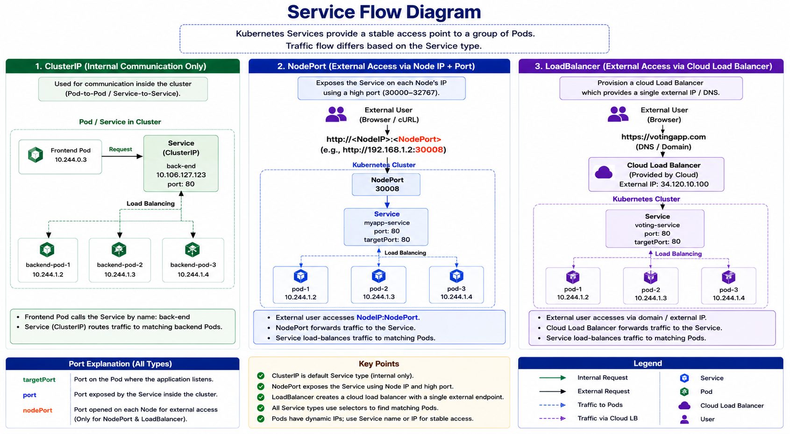

# Kubernetes Services Note

> This note explains Kubernetes Services in Myanmar language with an English visual diagram. It covers ClusterIP, NodePort, and LoadBalancer service types for CKA Core Concepts study.

---

## 1. Service ဆိုတာဘာလဲ?

**Service** ဆိုတာ Kubernetes ထဲမှာ Pods တွေဆီကို stable network access ပေးတဲ့ object ဖြစ်ပါတယ်။

Pod တွေက dynamic ဖြစ်တဲ့အတွက် Pod IP address တွေဟာ အချိန်မရွေးပြောင်းနိုင်ပါတယ်။ Pod တစ်လုံး delete ဖြစ်ပြီး အသစ်ပြန် create ဖြစ်လာရင် IP အသစ်ရနိုင်ပါတယ်။ ဒါကြောင့် application component တစ်ခုက Pod IP ကို တိုက်ရိုက်သုံးပြီး communicate လုပ်တာ မတည်ငြိမ်ပါဘူး။

```text
Pod IP = ပြောင်းနိုင်သည်
Service IP / Service Name = stable ဖြစ်သည်
```

Service က related Pods တွေကို **label selector** နဲ့ group လုပ်ပြီး stable access point တစ်ခုအနေနဲ့ traffic ကို Pods တွေဆီ route လုပ်ပေးပါတယ်။

---

## 2. Kubernetes Service ကိုဘာကြောင့်သုံးလဲ?

| Reason | Meaning |
|---|---|
| Stable Access | Pod IP ပြောင်းသွားလည်း Service name/IP နဲ့ ဆက်ခေါ်နိုင်သည် |
| Pod-to-Pod Communication | Frontend Pod က Backend Pod ကို stable way နဲ့ခေါ်နိုင်သည် |
| External Access | NodePort/LoadBalancer နဲ့ cluster အပြင်က user တွေ access လုပ်နိုင်သည် |
| Load Balancing | Matching Pods တွေကြား request ကို distribute လုပ်ပေးနိုင်သည် |
| Decoupling | Frontend, Backend, Database စတဲ့ components တွေကို loosely coupled ဖြစ်စေသည် |

အလွယ်မှတ်ရန်—

```text
Service = Pods တွေဆီ stable network entry point ပေးတဲ့ Kubernetes object
```

---

## 3. Service Types

Kubernetes Service type အဓိက ၃ မျိုးရှိပါတယ်။

| Service Type | Use Case |
|---|---|
| `ClusterIP` | Cluster အတွင်း internal communication အတွက် |
| `NodePort` | Node IP + high port နဲ့ external access အတွက် |
| `LoadBalancer` | Cloud provider load balancer နဲ့ public access အတွက် |

မှတ်ရန်—

```text
ClusterIP    = internal only
NodePort     = external access using node IP and port
LoadBalancer = cloud load balancer with single external endpoint
```

---

## 4. ClusterIP Service

**ClusterIP** ဆိုတာ Kubernetes Service ရဲ့ default type ဖြစ်ပြီး cluster အတွင်းမှာသာ access လုပ်နိုင်တဲ့ internal IP တစ်ခုကို ပေးပါတယ်။

ClusterIP ကို browser/public internet ကနေ တိုက်ရိုက် access မလုပ်နိုင်ပါဘူး။ Cluster ထဲက Pods တွေကသာ access လုပ်နိုင်ပါတယ်။

ဥပမာ microservices application တစ်ခုမှာ—

```text
Frontend Pods → Backend Service → Backend Pods
Backend Pods  → Redis Service   → Redis Pods
Backend Pods  → MySQL Service   → MySQL Pods
```

Frontend Pod က Backend Pod တစ်လုံးချင်းစီရဲ့ IP ကိုသိဖို့မလိုပါဘူး။ Backend Service name ကိုခေါ်ရုံနဲ့ Service က matching backend Pods တွေဆီ traffic ကို load balance လုပ်ပေးပါတယ်။

### ClusterIP YAML Example

```yaml
apiVersion: v1
kind: Service
metadata:
  name: back-end
spec:
  type: ClusterIP
  ports:
    - port: 80
      targetPort: 80
  selector:
    app: myapp
    type: back-end
```

### Field Explanation

| Field | Meaning |
|---|---|
| `apiVersion: v1` | Service API version |
| `kind: Service` | Resource type က Service |
| `metadata.name` | Service name |
| `type: ClusterIP` | Internal-only Service |
| `port` | Service ပေါ်က port |
| `targetPort` | Pod/container ထဲက application port |
| `selector` | ဘယ် Pods တွေကို target လုပ်မလဲဆိုတာရွေးသည် |

### ClusterIP Commands

```bash
kubectl create -f service-definition.yml
kubectl get services
kubectl get svc
```

Cluster ထဲက Pod တစ်ခုက service name နဲ့ ဒီလိုခေါ်နိုင်ပါတယ်။

```bash
curl http://back-end
```

---

## 5. NodePort Service

**NodePort** ဆိုတာ Kubernetes cluster အပြင်က user တွေ application ကို access လုပ်နိုင်အောင် Node IP ပေါ်က high port တစ်ခုကို Service နဲ့ map လုပ်ပေးတဲ့ Service type ဖြစ်ပါတယ်။

```text
Laptop/User → Node IP:NodePort → Service → Pod
```

Pod IP က internal network ထဲမှာရှိလို့ laptop/browser ကနေ တိုက်ရိုက် access မလုပ်နိုင်ပါဘူး။ NodePort Service က Node IP နဲ့ port တစ်ခုကိုသုံးပြီး Pod ထဲက application ကို access လုပ်နိုင်အောင်လုပ်ပေးပါတယ်။

ဥပမာ—

```bash
curl http://192.168.1.2:30008
```

ဒီမှာ—

```text
192.168.1.2 = Node IP
30008       = NodePort
```

### NodePort မှာ Ports ၃ မျိုး

| Port Type | Meaning |
|---|---|
| `targetPort` | Pod/container ထဲက application listen လုပ်နေတဲ့ port |
| `port` | Service ရဲ့ internal virtual port |
| `nodePort` | Node ပေါ်က external access port |

```text
User → NodeIP:30008 → Service port 80 → Pod targetPort 80
```

NodePort range က default အနေနဲ့—

```text
30000 - 32767
```

### NodePort YAML Example

```yaml
apiVersion: v1
kind: Service
metadata:
  name: myapp-service
spec:
  type: NodePort
  ports:
    - targetPort: 80
      port: 80
      nodePort: 30008
  selector:
    app: myapp
    type: front-end
```

---

## 6. selector ကဘာကြောင့်အရေးကြီးလဲ?

Service က ဘယ် Pods တွေဆီ traffic ပို့ရမလဲဆိုတာ `selector` နဲ့ဆုံးဖြတ်ပါတယ်။

Service selector—

```yaml
selector:
  app: myapp
  type: front-end
```

Pod label—

```yaml
metadata:
  labels:
    app: myapp
    type: front-end
```

ဒီနှစ်ခု match ဖြစ်မှ Service က Pod ကို target လုပ်နိုင်ပါတယ်။

```text
Service selector must match Pod labels.
```

---

## 7. LoadBalancer Service

**LoadBalancer** ဆိုတာ cloud environment တွေမှာ external load balancer ကို automatically create လုပ်ပေးတဲ့ Service type ဖြစ်ပါတယ်။

NodePort မှာ user က Node IP + high port ကိုသိဖို့လိုပါတယ်။

```text
http://node1-ip:30008
http://node2-ip:30008
http://node3-ip:30008
```

User တွေကတော့ single URL တစ်ခုနဲ့ access လုပ်ချင်ကြပါတယ်။

```text
https://votingapp.com
https://resultapp.com
```

LoadBalancer Service သုံးလိုက်ရင် cloud provider က external load balancer တစ်ခု provision လုပ်ပေးပြီး traffic ကို worker nodes/pods တွေဆီ distribute လုပ်ပေးပါတယ်။

### LoadBalancer ဘယ်မှာအလုပ်လုပ်လဲ?

LoadBalancer Service type က cloud provider support လိုပါတယ်။

```text
AWS
GCP
Azure
```

သတိထားရန်—

```text
VirtualBox / local unsupported environment မှာ LoadBalancer က real external load balancer မပေးနိုင်ပါ။
တချို့ local environments မှာ NodePort လိုပဲ behave ဖြစ်နိုင်ပါတယ်။
```

### LoadBalancer YAML Example

```yaml
apiVersion: v1
kind: Service
metadata:
  name: voting-service
spec:
  type: LoadBalancer
  ports:
    - port: 80
      targetPort: 80
  selector:
    app: voting-app
```

Check Service—

```bash
kubectl get svc
```

Cloud မှာဆို `EXTERNAL-IP` တစ်ခုရလာနိုင်ပါတယ်။

```text
NAME             TYPE           CLUSTER-IP      EXTERNAL-IP      PORT(S)        AGE
voting-service   LoadBalancer   10.96.10.20     34.120.10.100    80:30080/TCP   2m
```

---

## 8. ClusterIP vs NodePort vs LoadBalancer

| Feature | ClusterIP | NodePort | LoadBalancer |
|---|---|---|---|
| Access Scope | Internal only | External via Node IP + port | External via cloud load balancer |
| Default Type | Yes | No | No |
| External Access | No | Yes | Yes |
| Needs Cloud Provider | No | No | Yes |
| Common Use Case | Frontend → Backend | Lab/simple external access | Production public app |
| Example | `back-end:80` | `192.168.1.2:30008` | `external-ip:80` |

---

## 9. Service Flow Diagram



### Text Version

```text
ClusterIP:
Frontend Pod
    ↓
Backend Service / ClusterIP
    ↓
Backend Pods

NodePort:
External User
    ↓
NodeIP:NodePort
    ↓
Service
    ↓
Pods

LoadBalancer:
External User
    ↓
Cloud Load Balancer
    ↓
Service
    ↓
Pods
```

---

## 10. Useful Commands

| Task | Command |
|---|---|
| Create Service from YAML | `kubectl create -f service-definition.yml` |
| Get Services | `kubectl get services` |
| Short command | `kubectl get svc` |
| Describe Service | `kubectl describe svc <service-name>` |
| Delete Service | `kubectl delete svc <service-name>` |
| Check Pod labels | `kubectl get pods --show-labels` |
| Test ClusterIP from inside cluster | `curl http://service-name` |
| Test NodePort from outside | `curl http://node-ip:nodePort` |

---

## 11. CKA Exam မှာ မှတ်ရမယ့်အချက်များ

```text
Service provides stable access to Pods.
Pods have dynamic IPs.
Service uses selector to find matching Pods.
selector must match Pod labels.
ClusterIP is default Service type.
ClusterIP is for internal communication.
NodePort exposes app using Node IP and high port.
NodePort range is 30000-32767.
LoadBalancer works properly on supported cloud providers.
targetPort is the Pod/container port.
port is the Service port.
nodePort is the external node port.
```

---

## 12. Final Summary

Kubernetes Service ဆိုတာ Pods တွေဆီ stable network access ပေးတဲ့ object ဖြစ်ပါတယ်။ Pod IP တွေပြောင်းနိုင်တာကြောင့် application components တွေက Pod IP ကို တိုက်ရိုက်မသုံးသင့်ပါဘူး။ ClusterIP က cluster အတွင်း internal communication အတွက်သုံးပြီး NodePort က Node IP + port နဲ့ external access ပေးပါတယ်။ LoadBalancer က cloud provider ပေါ်မှာ external load balancer ကို automatically provision လုပ်ပြီး user-friendly external access ပေးပါတယ်။ CKA အတွက် `ClusterIP`, `NodePort`, `LoadBalancer`, `port`, `targetPort`, `nodePort`, `selector`, Pod labels တွေကို သေချာနားလည်ထားရပါမယ်။
