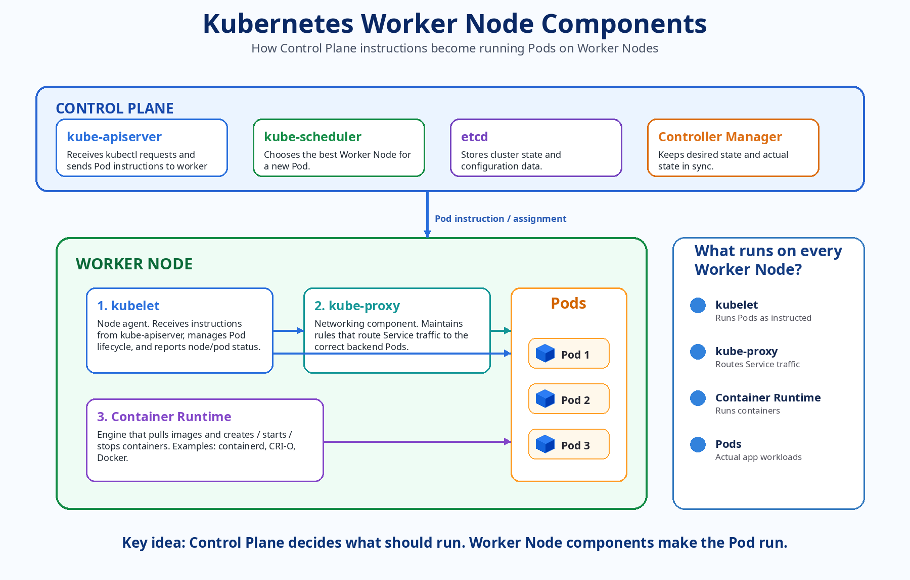
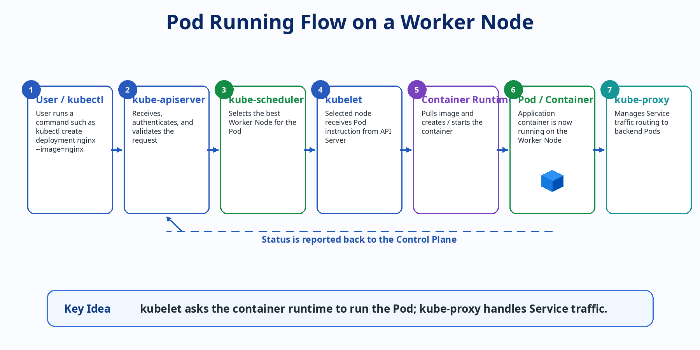

# Kubernetes Worker Node Components - Myanmar Note

> This note explains the main Kubernetes Worker Node components in Myanmar language with English visual diagrams.

---

## 1. Worker Node ဆိုတာဘာလဲ?

**Worker Node** ဆိုတာ Kubernetes cluster ထဲမှာ application workload တွေကို တကယ် run ပေးတဲ့ server ဖြစ်ပါတယ်။ ဒီ server က physical machine ဖြစ်နိုင်သလို virtual machine သို့မဟုတ် cloud instance လည်း ဖြစ်နိုင်ပါတယ်။ Pods, containers, application processes တွေက Worker Node ပေါ်မှာ run နေပါတယ်။

အလွယ်မှတ်ရန် -

```text
Control Plane = စီမံခန့်ခွဲသူ / ဆုံးဖြတ်ပေးသူ
Worker Node   = Pod/Container ကို တကယ် run ပေးသူ
```

Worker Node က Control Plane ကပေးတဲ့ instruction ကိုလက်ခံပြီး Pod/Container တွေကို run စေပါတယ်။

```text
Control Plane → kubelet → Container Runtime → Pod / Container
                 ↘
                  kube-proxy → Service Traffic Routing
```

---

## 2. Worker Node Components Visual Diagram



---

## 3. Worker Node ထဲက အဓိက Components

Worker Node ထဲမှာ အဓိက component တွေက အောက်ပါအတိုင်း ဖြစ်ပါတယ်။

| Component           | အဓိကအလုပ်                                                                             | အလွယ်မှတ်ရန်         |
| ------------------- | ------------------------------------------------------------------------------------- | -------------------- |
| `kubelet`           | API Server instruction ကိုလက်ခံပြီး Pod lifecycle ကို manage လုပ်သည်                  | Node agent / captain |
| `kube-proxy`        | Service traffic ကို backend Pods တွေဆီ route လုပ်ရန် network rules တွေ manage လုပ်သည် | Traffic manager      |
| `Container Runtime` | Container image pull လုပ်ပြီး container ကို create/start/stop လုပ်သည်                 | Container engine     |
| `Pods / Containers` | Application workload တွေ run နေသော unit ဖြစ်သည်                                       | Actual application   |

---

## 4. kubelet အကြောင်း

**kubelet** က Worker Node တစ်လုံးချင်းစီမှာ run တဲ့ node agent ဖြစ်ပါတယ်။ Control Plane ထဲက `kube-apiserver` က “ဒီ Pod ကို ဒီ node ပေါ်မှာ run ပါ” လို့ instruction ပေးတဲ့အခါ `kubelet` က အဲဒီ instruction ကိုလက်ခံပြီး Pod run ဖြစ်အောင် ဆောင်ရွက်ပါတယ်။

အလွယ်ပြောရင် -

```text
kubelet = Worker Node ပေါ်က agent / captain
```

### kubelet ရဲ့ အဓိကတာဝန်များ

- API Server ဆီက Pod instruction ကိုလက်ခံသည်။
- Pod lifecycle ကို manage လုပ်သည်။
- Container Runtime ကိုခိုင်းပြီး image pull လုပ်စေသည်။
- Container create / start / stop လုပ်ရန် runtime ကိုခိုင်းသည်။
- Pod health နှင့် Node status ကို API Server ဆီ report ပြန်ပေးသည်။

### အရေးကြီးမှတ်ရန်

`kubelet` ကိုယ်တိုင် container ကို run တာမဟုတ်ပါ။ `kubelet` က **Container Runtime** ကိုခိုင်းပြီး container ကို run စေတာဖြစ်ပါတယ်။

```text
kubelet → Container Runtime → Container
```

---

## 5. Container Runtime အကြောင်း

**Container Runtime** က container ကို တကယ် run ပေးတဲ့ engine ဖြစ်ပါတယ်။ Kubernetes မှာ `kubelet` က container runtime ကိုခိုင်းပြီး image pull လုပ်စေတယ်၊ container create/start/stop လုပ်စေတယ်။

အသုံးများသော Container Runtime များ -

- `containerd`
- `CRI-O`
- `Docker Engine`

Modern Kubernetes environment တွေမှာ `containerd` ကိုအများကြီးသုံးကြပါတယ်။

### Container Runtime ရဲ့ အဓိကတာဝန်များ

- Container image ကို registry ကနေ pull လုပ်သည်။
- Container ကို create လုပ်သည်။
- Container ကို start / stop လုပ်သည်။
- Container lifecycle ကို manage လုပ်သည်။

---

## 6. kube-proxy အကြောင်း

**kube-proxy** က Worker Node တိုင်းမှာ run တဲ့ networking component ဖြစ်ပါတယ်။ Kubernetes ထဲမှာ Pod IP တွေက အချိန်မရွေးပြောင်းနိုင်တာကြောင့် application တွေက Pod IP ကိုတိုက်ရိုက်ခေါ်တာထက် **Service** ကိုခေါ်ကြပါတယ်။

`kube-proxy` က Service traffic ကို မှန်ကန်တဲ့ backend Pods တွေဆီရောက်အောင် network rules တွေ configure လုပ်ပေးပါတယ်။

```text
Client / Pod → Service → kube-proxy rules → Backend Pods
```

### kube-proxy ရဲ့ အဓိကတာဝန်များ

- Service နှင့် Endpoint changes တွေကို watch လုပ်သည်။
- Node ပေါ်မှာ network rules တွေ configure လုပ်သည်။
- Service IP traffic ကို backend Pod တွေဆီ route လုပ်သည်။
- Service-to-Pod communication ကိုကူညီသည်။
- Pods အများကြီးရှိတဲ့အခါ traffic distribution အတွက်ပါဝင်သည်။

---

## 7. Pod တစ်ခု Worker Node ပေါ် Run ဖြစ်လာတဲ့ Flow



ဥပမာ `nginx` deployment တစ်ခု create လုပ်မယ်ဆိုပါစို့။

```bash
kubectl create deployment nginx --image=nginx
```

### Step-by-step Flow

1. User က `kubectl` command run လုပ်သည်။
2. Request က `kube-apiserver` ဆီသွားသည်။
3. `kube-scheduler` က Pod ကို ဘယ် Worker Node ပေါ်တင်မလဲ ဆုံးဖြတ်သည်။
4. ရွေးချယ်ခံရတဲ့ Worker Node ပေါ်က `kubelet` က instruction လက်ခံသည်။
5. `kubelet` က `Container Runtime` ကို Pod run ဖို့ခိုင်းသည်။
6. `Container Runtime` က container ကို တကယ် run ပေးသည်။
7. `kube-proxy` က Service traffic နှင့် network communication ကို manage လုပ်သည်။

---

## 8. Component Summary Table

| Component           | အဓိကအလုပ်                                                                                                       | အလွယ်မှတ်ရန်         |
| ------------------- | --------------------------------------------------------------------------------------------------------------- | -------------------- |
| `kubelet`           | Pod lifecycle ကို node ပေါ်မှာ manage လုပ်သည်။ API Server instruction လက်ခံပြီး container runtime ကိုခိုင်းသည်။ | Node agent / captain |
| `kube-proxy`        | Service traffic ကို backend Pods တွေဆီ route လုပ်ဖို့ network rules တွေ manage လုပ်သည်။                         | Traffic manager      |
| `Container Runtime` | Container image pull လုပ်ပြီး container ကို create/start/stop လုပ်သည်။                                          | Container engine     |
| `Pods / Containers` | Application workload တွေ run နေတဲ့ unit ဖြစ်သည်။                                                                | Actual application   |

---

## 9. Exam-style မှတ်ရန် Points

- `kubelet` သည် Worker Node တိုင်းမှာ run သည်။
- `kubelet` သည် API Server နှင့် communicate လုပ်ပြီး Pod status ကို report ပြန်ပေးသည်။
- Container Runtime သည် container ကို တကယ် run ပေးတဲ့ engine ဖြစ်သည်။
- `kube-proxy` သည် Service traffic routing အတွက် အရေးကြီးသည်။
- Pod ကို ဘယ် node ပေါ် run မလဲဆုံးဖြတ်တာက `kube-scheduler` ဖြစ်ပြီး တကယ် run စေတာက selected node ပေါ်က `kubelet` ဖြစ်သည်။

---

## 10. Useful Commands

### Nodes ကြည့်ရန်

```bash
kubectl get nodes
```

### Pods ကြည့်ရန်

```bash
kubectl get pods -o wide
```

### Pod အသေးစိတ်ကြည့်ရန်

```bash
kubectl describe pod <pod-name>
```

### Node အသေးစိတ်ကြည့်ရန်

```bash
kubectl describe node <node-name>
```

### Pod logs ကြည့်ရန်

```bash
kubectl logs <pod-name>
```

### Events ကြည့်ရန်

```bash
kubectl get events --sort-by=.metadata.creationTimestamp
```

---

## 11. Final Takeaway

Worker Node က application တွေတကယ် run နေတဲ့နေရာဖြစ်ပြီး `kubelet` က Pod ကို run စေတယ်၊ Container Runtime က container ကိုမောင်းတယ်၊ `kube-proxy` က Service/network traffic ကိုထိန်းပေးတယ်။

အလွယ်မှတ်ရန် -

```text
Control Plane tells what to do.
Worker Node does it.

kubelet = receives instructions and manages Pods
Container Runtime = runs containers
kube-proxy = manages Service traffic routing
```
